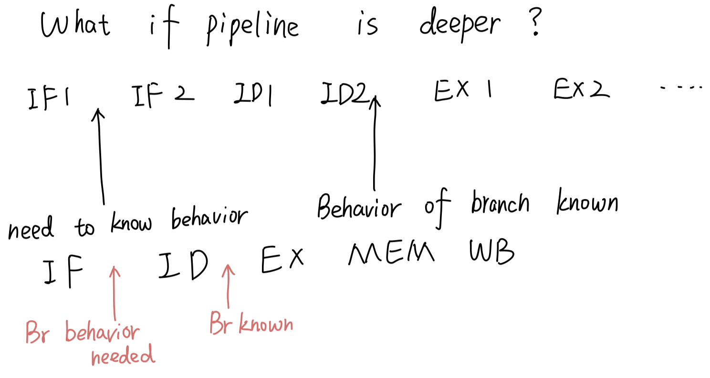
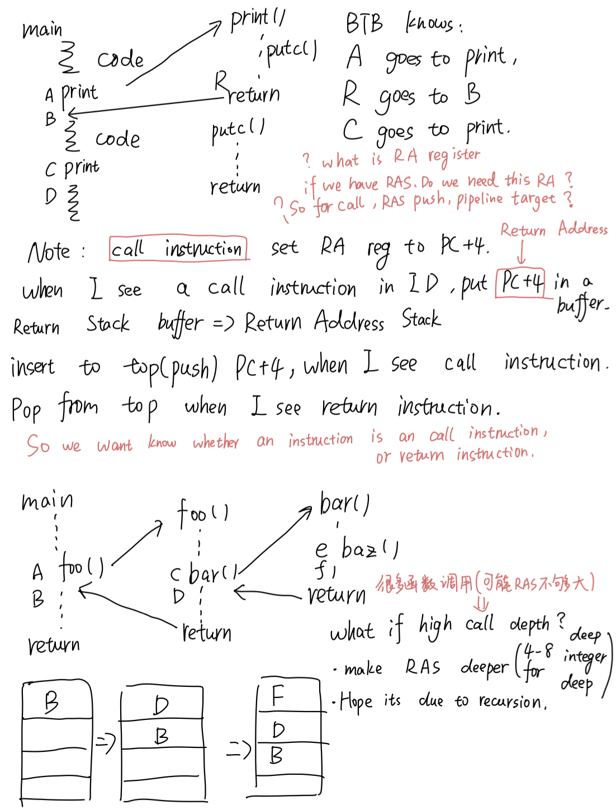
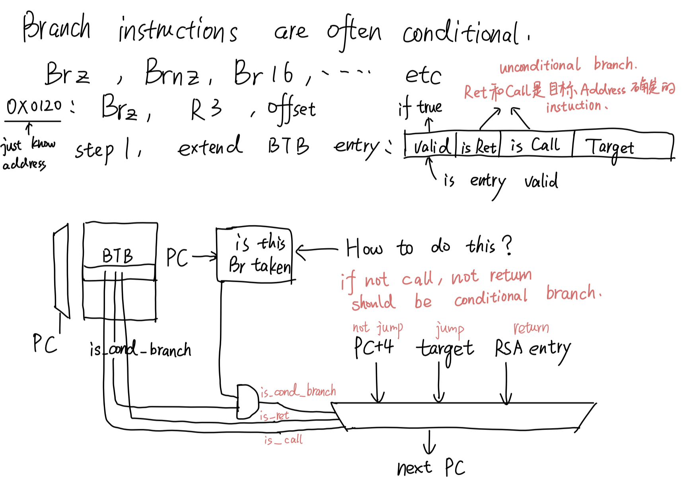
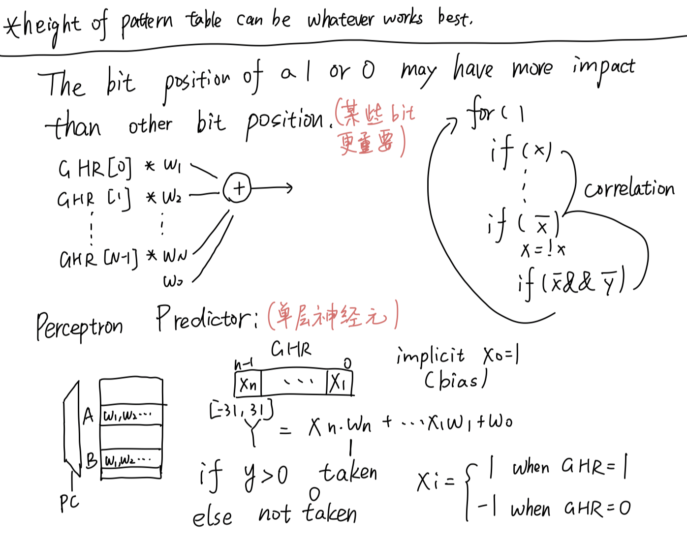

# ECE6100 Review

Exam2 Review

## Pipeline

Stall: 

#### 1: structural Hazard

当两个指令同时使用MEM的时候。一个在IF，一个在MEM。但是只有一个能用cache，导致stall。

解决方法： 增加硬件，给IF和MEM都提供一个Cache。

CPI_nopipe = N

CPI_pipe = 1 + Avg stall cycles per ins.

Speed_up = N/(1 + avg_stall)

#### Control Hazard:

Branch 导致的stall

因为一个Branch在IF阶段没法确定下一条指令的位置。

To solve the branch stall: use likely bit to indicate whether go target or not.

If frequently taken: set L = 1, fetch target instruction after branch. Need to squash if branch not taken.

Else, set L = 0, fetch the next instruction. Need to squash if branch is taken.

#### 对于branch prediction的优化方式：

这个inst是否是branch？ ： 通过BTB来准确知道？（难道说BTB说是branch，一定是branch，BTB说不是branch，可能是branch。怎么有点像bloom filter？）BTB到底储存PC address还是valid bit?

如果是branch，他是否taken？ 通过各种Predictor和likeli bit?

如果taken，我应该fetch 哪一条指令？通过BTB？

### What if pipeline is deeper?

当pipeline deeper的情况，branch错的后果会错很多。

但是我们在IF的阶段只知道Branch指令的address。我们尝试利用address来知道branch的target address和是否branch。

#### Branch Target Buffer

通过hash[PC]找到BTB中的位置，get the information of this branch.

问题？ 怎么知道一个inst是一个branch？

#### 对于函数call和return

对于函数调用和函数return的指令。我们希望在函数调用的时候记录下return的address。

所以使用Return address stack来记录return的address。当call的时候，将PC+4的address 放入RAS的top。

当return的时候，从RAS中pop出address来return。

问题？如果没有RAS的时候是怎么return的？如何来获得address？

如果有太多的call instruction.一直往RAT中push。那当pop的时候曾经的一些address溢出来。

我们希望他是recursive 调用。一直使用最后一个出栈的元素当作return address。

**对于函数调用和return，是unconditional的，是确定调用位置的。Branch instruction都是conditional的。**

通过在BTB中增加更多的内容，来更好地进行预测。

BTB中的内容：

我问了问gpt，它说： 有branch instruction address, branch target address, taken/not taken.

我其实有个疑惑。因为在IF阶段，我们只知道inst的address。所以我们不知道一个inst是不是branch inst. 用address在BTB中找，得到inst是不是branch。如果不存branch address，如果将一个不是branch的inst预测成branch，不是很蛋疼吗？而且每个inst都要去BTB中找，总觉得效率不高。

#### 为什么需要预测Branch？

因为当pipeline很深的时候，branch预测错误后果很严重。而且在程序中，branch的频率很高。这里是branch和CPI的计算。

#### Branch Predictor：

当一个inst已经知道是branch指令之后。有多种predictor策略：

#### Bimodel Predictor

提出了4-state machine 的概念（2 bit state machine，2 bit saturating counter）

为每一个PC hash记录一个state，通过branch是否actual taken和右边的状态机来更新state。

但是这样PC hash的collision很多。下面就引出了GHR。

#### Global History Register

提出了global history register的概念。

GHR是一个shift register（左移动），来记录N个最近遇到的branch是否taken。

通过历史的信息，来判断当前的branch是否taken。

同时，比起上面的bimodel predictor，减少PC_Hash的collision。因为通过PC_Hash和GHR一起定位到一个state

#### G-Select

这是一个使用GHR的例子。将PC hash定位到行。用GHR定位到列。通过得到的值来predict。

11: T, 10: T, 01: F, 00: F（2 bit saturating counter状态机来更新）

用Actual 结果（branch是否taken）来更新table。

#### 另一种G-Select（G-Share）

使用PC XOR GHR在table中选择。是对于bimodel的改进。其实G-Select和G-Share都是利用了PC_Addr和GHR的信息，来得到一个branch inst是否taken。

#### Yel-Patt Predictor

通过PC_hash来找到对应的history table。在通过history bit来找Pattern Table(2-bit saturating)。通过state来判断是否taken。

使用actual是否taken同时更新对应的 History table（Shift 更新）和Pattern table（State Machine 更新）。

相当于对于每一个PC_Hash的地址有一个GHR(记录这个address过去是否taken)。  

如果HT是3bits，那Pattern table就有2**3个entry。

#### Perceptron Predictor

用一个单层神经网络来给不同的GHR不同的预测weight。

用X和W计算Y，如果Y>0预测taken，Y<0，预测not taken。

比如： 初始化每个weight都是1

如果prediction错了，且Y小于一个定值。

wi = wi + actual * xi（actual是true or false）

用强化学习的方式来更新不同GHR的bit的w。

#### Hybrid Predictor

至此，结束了Branch prediction的内容。

#### 关于data dependency

有三种data dependency.就是图片里的三种情况。这三种中，只有Read After write是True dependency（因为写一个register是用来之后读的）。

别的dependency（WAR，WAW）可以通过增加增加register来避免。当register越多，发生False dependency的可能行越少，CPI也会变小。

**注意：RAW并不一定会导致stall。通过三个Bypass，可以避免一些Read-After-Write的dependency。**

要避免RAW stall。一个instruction需要在EX之前拿到reg value。

#### ByPass 1-3

**ID/EX Bypass1**: Inst计算完数据（EX 阶段），将新的value输入到后面的inst的Decode MUX。

后面的inst的reg value从MUX的输入中选择合适的输入。

**Ex/MeM Bypass2**： Inst在Mem阶段，将新的value输入到后面的inst的Decode Mux。

**Mem/Wb Bypass3**: Inst在WB阶段，将新的value输入到后面的inst的Decode Mux。（如果Register File支持Write to RF before read就可以不需要这个Bypass）

#### Load RAW stall

但是对于Load inst，没有办法避免RAW导致的stall。因为load的数据在MEM之后才能拿到，但是下一个inst需要在EX之前拿到数据。

#### Superscalar

上面这张图下方，CPI = 1+ stalls，IPC = inst/cycle。其实我没太懂这个写了啥。但是如果我们能一个cycle 进行多个指令，我们的CPU就可以减少很多。在这儿，引出了Superscalar的概念。

有四种类型： 指令是否按顺序发送，执行指令是否按顺序。

同时，在现实中，不同的指令需要不同的cycle数。

比如： ADD 2cycles， MUL： 3 cycles， LD 2cycles， SW2 cycles。

#### FICO， Scoreboard

计分牌算法：

将每个指令分为四个阶段： IF, DISP, Ex, WB。（为什么没有ID和MEM？是不是在DISP中包含了ID，Ex中包含了MEM？）

只考虑Scheduling/Dispatch Queue中的第一条指令。如果这个Inst的src reg和dest reg都不是Busy，FU也有空着的。就将FU设为Busy，Dest reg设为busy = 1，然后Fire Inst。结束的时候将FU和dest reg Busy=0。

不然就等。

**注意： 计分牌算法是in order发放指令的。不能超车。后面的指令一定得等前面Disp了，才能Disp。**

这也是计分牌算法的不足。也引出了Tomasulu算法。

#### Tomasulo's 算法

一个指令： MUL R1 R2->R3（src: R1,R2 dest: R3）
Decode阶段：
首先在对应的reservation station找一个空的slot（找不到需要stall）
记录R1，R2是否ready，如果valid，获得他们的value，不valid的话，获得他们的tag
将Dest reg的valid设置为否，将dest reg的tag和这个instruction的tag对应。
当这个instruction执行完成，broadcast自己的tag和value。dest reg检查到tag，重新变成valid，并且将这个instruction的执行结果写入自己的value。

broadcast两个东西：
完成的inst的tag, inst的计算结果（dest reg的新value)

broadcast给RF和reservation station中的所有reg对象
如果tag match，设置为valid，然后value等于broadcast的value

有个问题，是只有invalid进行比较吗？match之后tag需要清除吗？

#### Imprecise exception

但是Tomasulu算法没有解决imprecise exception的问题。

我们为什么想要precise exception？

#### ROB（保守策略）

ROB是第一种解决方案：

但是后面的inst需要reg。reg新的值可能在ROB中，而不是Register file中。所以，要么同时在RF和ROB中找，要么增加ROB Bypass。（都增加了Latency）

第一种方式： Bypass4

第二种方式：Indirection（RAT）

通过RAT增加了indirection。上面的是额外的register。下面的是read register file。

#### RAT

indirection的方法。

#### History Buffer（激进策略）

激进策略

#### Future File+ ROB

使用Future File来快速获得reg的value。使用Architectural file当exception的时候恢复reg value。

这个是In-Order Pipeline with Future file and Reorder Buffer.

当一个instruction complete的时候，同时将结果在ROB和Future File中更新。

当一个inst 要retire的时候，check是否exception。没有exception： 将value写进Architectural file。如果发生exception，将architectural file的内容写回future file。

****

#### Checkpoint

可以恢复还没有retire的inst的reg状态。比如解决mis prediction。

