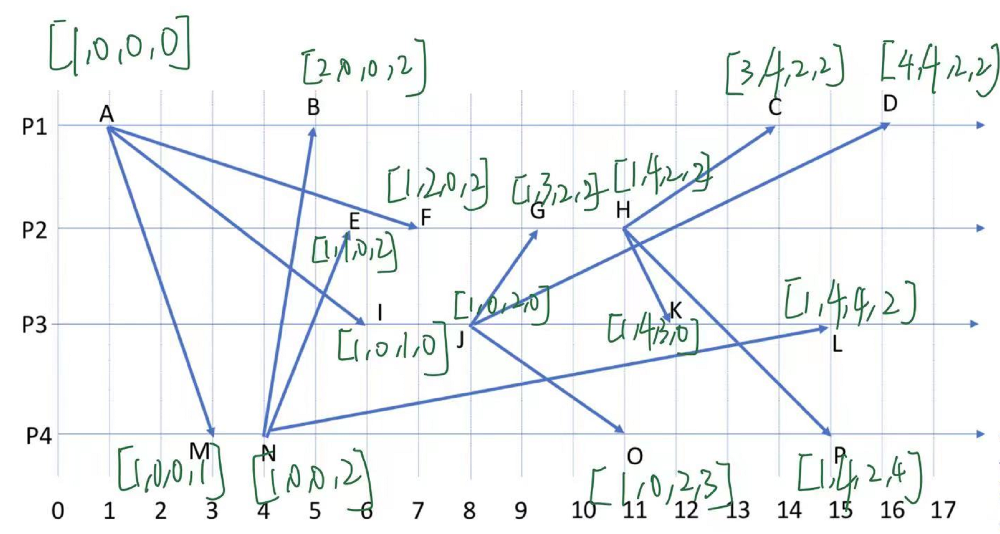

HW1

## Q1

a:

This ring-based failure is because when two neighboring nodes fail, the tail node information is lost. So this one direction ring list can add a reverse heartbeat to enable bidirectional check. Thus every node can have two way to check the failure. 

In this situation, the bandwidth cost is double. As the communication times double.

b: 

1 The timeout for a node should be the maximum round time. Thus the time should use the maximum one way cost and the waiting time times the number of node.
$$
n(\triangle+T)
$$
2 The maximum detection is when a node send the heartbeat and die immediately. So the detection time is that from the time token is sent from the dying node until the token should be sent back to the next node. 
$$
\triangle +n(\triangle+T)
$$

## Q2

a: Maximum one way delay is triangle and every T seconds a heartbeat will be sent. And the drift value is 0.01, which means two nodes will add  (T+triangle)*0.01 sections or minus (T+triangle)*0.01 seconds every failure check. So the timeout value should be the maximum time gap, which is (T+triangle)*1.01.

b: maximum detection time is when a node dies immediately after sending the heartbeat. So the maximum detection is **triangle*1.01+(T+ triangle)*1.01**

c: The Cristian's algorithm will make two node synchronize with time delay within RTT/2(10ms). So when the time delay add time drift increasing to 100ms, this system need to rerun the Cristian's algorithm.

So (100-10)/0,01 = 9000ms

## Q3

a: To realize the minimum time delay, we need to connect the nodes with the min RTT channel. So synchronize the AC and BE first. Then, synchronize the AC with B and BE with D. So all the nodes are connected together. The time delay between A and D is 30/2 = 15ms.

b: The waiting time show the total time of the sending and receiving. 

s1+r1 =9

s2+r2 = 4

s3+r3 = 12

s1+r2 = 10

s1+r3 = 13

s2+r3= 7

s2+r1 = 3

r1+s3 =8

r2+s3=9

Thus: 

s1 < 9

s2 <3

s3 <8

r1 <3

r2 <4

r3 <7

c:

Use the s and r limit to calculate the interval limit of the B. And the move value should between 4 and 7, move toward the left direction.

## Q4

Lamport timestamp:

 Vector：

c:(从这个点之前的点往后找。)

1：C

KPLO

2: I

MFBEN

3 :O

HKCDBELFGKCD

## Q5

BFJN

BGJN
BHJN

BFJO

BGJO

BHJO

BHJP

CHJO

CHJP

DHJO

DHJP

BHKN

BHKO

BHKP

CHKN

CHKO

CHKP

DHKN

DHKO
DHKP

DHLO

DHLP

太多了 我晕倒了。

