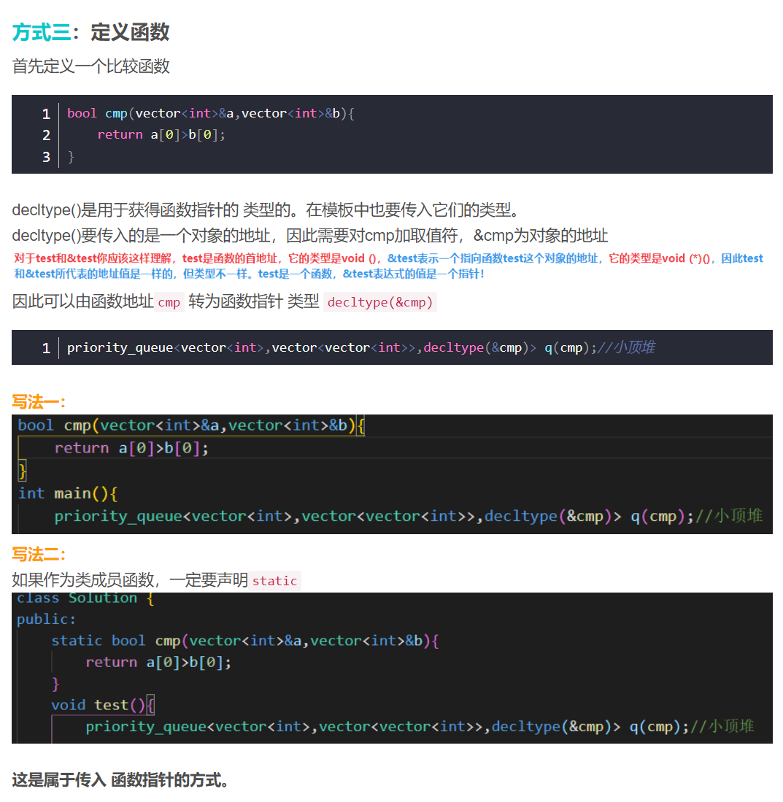

# 这个文档是C++有趣的知识点整理

[toc]

**一般是一些我在刷题的时候遇到的不太理解的代码和写法用法的一些整理。希望能记录下来让自己能更加理解代码的运行!!**🐱

## 函数指针和函数对象

今天2023/3/8，好几天没有写Leetcode了，我遇到了一道**优先队列**的题目，在这个题目里面需要自定义Priority_queue的Cmp方法。这种问题我遇到很多次了，但是再次遇到还是没办法很流畅地完成。

一直不是很理解**为什么优先队列容器中的Cmp函数不能和Sort中的Cmp一样使用函数作为输入，需要使用结构体或者类的()重载**。今天想彻底理解清楚。


### 关于Sort函数的Cmp：

sort函数的使用:

sort(iterator start, iterator end,cmp)//end是尾地址的下一个地址

sort(first_pointer, last_pointer+1, cmp)

```c++
#include <iostream>
#include <algorithm>//sort在stl的这个函数中。
 
using namespace std ;
 
bool cmp(int a ,int b)
{
	return a < b ;			//从小到大排序，把 < 换成 > 就是从大到小 
}

int main()
{
	int a[10]={-1,9,5,7,-11,2,6,8,9,6};
	sort(a,a+10,cmp);//在sort中的传参，直接传入函数本身。
	for(int i = 0 ; i < 10 ; ++i)
	{
		cout<<a[i]<<" " ; 
	}
	cout<<endl ; 
	return 0 ;
}
原文链接：https://blog.csdn.net/lionel_d/article/details/41746135
```

在这段代码中的Cmp直接输入函数名。

有个疑问？？？这个输入的Cmp是什么？难道是函数指针吗？作为一个变量，除了函数指针还能是什么？


### **关于priority_queue中的cmp：**

*参考网址：*[(8条消息) c++优先队列priority_queue（自定义比较函数）_c++优先队列自定义比较_菊头蝙蝠的博客-CSDN博客](https://jutou.blog.csdn.net/article/details/122128445?spm=1001.2101.3001.6661.1&utm_medium=distribute.pc_relevant_t0.none-task-blog-2~default~CTRLIST~Rate-1-122128445-blog-53485887.pc_relevant_recovery_v2&depth_1-utm_source=distribute.pc_relevant_t0.none-task-blog-2~default~CTRLIST~Rate-1-122128445-blog-53485887.pc_relevant_recovery_v2&utm_relevant_index=1)


这个内容解释了在容器中的cmp输入和内容。

最后一句说到：**这个cmp输入可以是函数指针或者函数对象。**

这是两个我没有很清楚的名词。函数指针在ECE391中使用过，但没有特别理解。

#### **函数指针：**

指向函数地址的变量，在CPU眼中和普通的变量没有区别。

每个函数都有一个入口地址，这个指针就指向这个地址。

函数指针的用途：

* 调用函数。
* 作为参数传入，在多线程中也有作用。

**函数指针的声明：**

```c++
//例子
int func(int x);//声明了一个函数
int (*func) (int x);//声明了一个函数指针（确定了return类型，参数个数，参数类型）
```

**函数指针调用函数：**

```c++
#include<iostream>
#include<cstdlib>
#include<vector>

using namespace std;

int AddFunc(int a, int b)  
{  
    return a + b;  
}   
int main()
{
    int (*Add1)(int a,int b);
    int (*Add2)(int a,int b);//定义了两个函数指针
 
    Add1 = &AddFunc;
    Add2 = AddFunc;//两种函数指针赋初值方法，可以加取地址符也可以不加
 
    cout << (*Add1)(3,2)<<endl; // 加*更像个指针哈哈哈
    cout<<Add1(3,2)<<endl;//输出可以加*，也可以不加
    return 0;
}
```

**函数指针传参：**

```c++
int CmpAsc(int x, int y)
{
    //如果x>y返回1，否则返回0；
    if(x>y)return 1;
    else return 0;
}
//使用函数指针传参的格式!!在后面参数的括号里面只写数据类型
void sort(int a[], int n, int (*cmp)(int,int))//最后一个参数为函数指针类型参数
{
    /*对数组a排序，排序原则由cmp指定，若cmp为真，表示两元素逆序*/
    for(int i=0;i<n-1;i++)
        for(int j=i+1;j<n;j++)
            if(cmp(a[i],a[j]))//调用传进来的函数指针
                swap(a[i],a[j]);
}

int main(int argc, const char * argv[]) {
    // insert code here...
    
    int a[6] ={8,2,1,3,4,5};
    sort(a, 6, CmpAsc);//CmpAsc函数名作为参数传递给函数sort
    for(auto &e:a)
        cout<<e<<" ";
    return 0;
}

```

```c++
#include<stdio.h>
int add(int a, int b){
    return a+b;
}
int process(int (*p)(int,int), int a,int b){
    int ret;
    ret = (*p)(a,b);
    return ret;
}
int main(){
    int num;
    num = process(add, 2,3);
    printf("num=%d\n",num);
}
```

通过函数指针，我们可以在函数中调用形式相同的不同函数，同时在多线程任务中我们可以使用使用函数指针给子线程传参。

##### 关于函数指针中typedef的使用：

我们熟悉的typedef：

```c++
int i;//定义一个整型变量i
typedef  int myInt；
myInt j;//定义一个整型变量j
//typedef的作用是给一个类型进行了重命名
```

**函数指针中typedef的使用：**

```c++
typedef char (*PTRFUN)(int); //这一行定义了函数指针类型PTRFUN 
PTRFUN pFun; //使用这个类型创建了函数指针实例
char glFun(int a){ return;} 
void main() 
{ 
    pFun = glFun; //函数指针赋值（地址）
    (*pFun)(2); //调用
}
```

这种typedef的使用使函数指针的定义方便了很多。


#### 函数对象：

函数对象的本质的操作符重载，实现了对于()操作符的重载。C++函数对象不是函数指针。但是，在程序代码中，**它的调用方式与函数指针一样，后面加个括号就可以了**。

```c++
int AddFunc(int a, int b)  
{  
    return a + b;  
}  
 
class Add//本质上定义了一个类或者结构体，在使用实例进行运算。
{
public:
    const int operator()(const int a,const int b)//重载了括号操作符就变成了函数对象。
    {
        return a+b;
    }
};
 
int main()
{
    //函数指针
    int (*Add1)(int a,int b);
    int (*Add2)(int a,int b);//声明了两个函数指针
    Add1 = &AddFunc;
    Add2 = AddFunc;//两种函数指针赋初值方法
    cout << (*Add1)(3,2)<<endl; // 5
    cout<<Add1(3,2)<<endl;//输出可以加*，也可以不加
 
    //函数对象
    Add addFunction;
    cout<<addFunction(2,3)<<endl;//调用类的重载操作符()方法
    system("pause");
    return 0;
}
```


#### 函数对象与函数指针比较

关于函数指针和函数对象的内容参考了这个链接：

[(8条消息) C++函数指针、函数对象与C++11 function对象对比分析_wuxiaoxiao2021的博客-CSDN博客](https://blog.csdn.net/vict_wang/article/details/81590984)

**函数对象可以把附加对象保存在函数对象中是它最大的优点**。

**另外，C++函数对象还有一个函数指针无法匹敌的用法：可以用来封装类成员函数指针。**

它的弱势也很明显，它虽然用起来象函数指针，但毕竟不是真正的函数指针。在使用函数指针的场合中，它就无能为力了。例如，你不能将函数对象传给qsort函数！因为它只接受函数指针。


**回到优先队列的自定义函数：**

我们来总结一下自定义cmp的方式：

**方式1：struct重载运算符()：**

```c++
struct cmp{
    //重载运算符的写法和正常函数完全一样，需要return类型和参数。
  	bool operator()(vector<int> &a, vector<int> &b){
        return a[0]>b[0];//把vector的第一个数字比较，升序排列，最小的先出来。
    }  
};
//优先队列元素：vector<int>，封装容器: vector<vector<int>>,cmp方法：结构体函数对象
priority_queue<vector<int>,vector<vector<int>>,cmp> q;//小顶堆
```

**方式2：class重载运算符()**

```c++
class cmp{
public://注意 一定要是public类哦！！！
    bool operator()(vector<int>&a,vector<int>&b){
        return a[0]>b[0]; 
    }
};
priority_queue<vector<int>,vector<vector<int>>,cmp> q;//小顶堆

```

**方式3：定义函数，使用函数指针：**

```c++
bool cmp(vector<int>&a,vector<int>&b){
	return a[0]>b[0];
}

priority_queue<vector<int>,vector<vector<int>>,decltype(&cmp)> q(cmp);//小顶堆
//其实对于这个函数指针的传入和q(cmp)不是很理解
//decltype可以获得变量的类型，类似于typeid().name()
//使用typeid(变量).name()可以获得变量的类型 可以看下面的函数。
```



这里其实不是很懂。所以把图片记录下来。

#### 插曲：decltype和typeid

*相关网址：*[(8条消息) 【C++深陷】之“decltype”_Jinxk8的博客-CSDN博客](https://blog.csdn.net/u014609638/article/details/106987131/)

```c++
//在学习的过程中发现了decltype和typeid的使用 在这里记录
#include<iostream>
#include <typeinfo> 
using namespace std;
 
bool cmp(int a, int b) {
    return a > b;
}
int main() {
    decltype(cmp) *t;//一个指向函数类型的指针(类型见第20行)
    decltype(&cmp) t1;//函数指针！
    bool t2;
    int a;
    t = cmp;
    t1 = cmp;//对函数指针赋值
    int value1 = t1(2,10);
    int value2 = t(10,2);
    cout<< value1 <<endl;                    //输出值：1
    cout<< value2 <<endl;                    //输出值：0
    cout << typeid(t).name() << endl;        //bool __cdecl(int,int)函数的类型形式
    cout << typeid(t1).name() << endl;       //bool (__cdecl*)(int,int)函数指针
    cout << typeid(t2).name() << endl;       //bool
    cout << typeid(a).name() << endl;       //bool
}
```

要是想获得函数指针的方法：

* 1： decltype(&func) T;
* 2:  decltype(func) *T;

#### 总结：

我觉得我应该掌握了传入函数对象的方式，也就是在结构体或类中重载()的方法。

对于函数指针的方法，我还不是很清楚为什么不能直接传入函数(类似qsort)，需要使用decltype的转换，和后面的q(cmp)。希望以后能够理解。


## static函数和引用：

*相关链接*[(8条消息) C++ sort函数中cmp()比较函数的写法_cmp函数_mmmyles的博客-CSDN博客](https://blog.csdn.net/weixin_53833977/article/details/124322406)

在这篇文章中，cmp函数中使用了静态函数，引用和const变量，有不少有趣的知识。

### 引用：

在函数传参的过程中，如果不加引用，传入的参数会拷贝出副本，修改时，原有的参数并不会被修改（因此在递归中，要修改一直修改的参数要么传递指针，要么传递引用），同时，有些变量拷贝时会消耗大量时间（例如string）。

```c++
//常见的引用：
int a =1;
int &b=a;//b是a的别名，指向同一个内存空间。

int i=5;
int *p=&i;//p是指针，指向i（&是取地址的意思）
int * &pt=p;//建立指针变量p的引用pt（&是引用的意思）
```

引用在函数传参中可以经常使用，可以起到变量一致性，不创造拷贝的作用。同时，如果不希望传入的变量被修改，可以在前面加上const进行限制。(如下面例子)（**const位置在类型之前！**）

```c++
 static bool cmp(const vector<int>& a, const vector<int>& b) {
        if (a[0] == b[0]) return a[1] < b[1];	[0]相同则比较[1]
        return a[0] > b[0];  					比较[0]
    }
```

### Static:

**Static**修饰的函数叫做静态函数，静态函数有两种，根据其出现的地方来分类：

* 出现在类里，是一个静态成员函数；

静态成员函数的作用在于：调用这个函数不会访问或者修改任何对象（非static）数据成员。

  其实很好理解:

**类的静态成员(变量和方法)属于类本身，在类加载的时候就会分配内存，可以通过类名直接去访问；**(不需要this指针，因为静态成员函数一直存在)

**非静态成员（变量和方法）属于类的对象，所以只有在类的对象产生（创建类的实例）时才会分配内存，然后通过类的对象（实例）去访问。**(有参数中有隐藏的this指针用于访问自身地址)

* 不是在类里，全局静态函数；

	#### 插曲：this指针：

	this指针不占用大小，this指针指向对象的首地址。静态成员函数先于对象存在，所有对象共享，没有this指针。

* 同时static函数只在声明的文件中可见，不能被其他文件调用。所以在其他文件中可以有名字相同的函数。

## 内存分配：

**一、存储器**

**RAM: 随机存取存储器（random access memory）**又称作“随机存储器”，是与CPU直接交换数据的内部存储器，也叫主存(内存)。它可以**随时读写**，而且**速度很快**，通常作为操作系统或其他正在运行中的程序的临时数据存储媒介。存储单元的内容可按需随意取出或存入，且存取的速度与存储单元的位置无关的存储器。这种存储器在断电时将丢失其存储内容，故主要用于存储短时间使用的程序

**ROM: 只读存储器（Read-Only Memory）**，是一种只能读出事先所存数据的固态半导体存储器。其特性是一旦储存资料就**无法再将之改变或删除**。通常用在不需经常变更资料的电子或电脑系统中，并且资料不会因为电源关闭而消失,CPU是不能直接访问的，而是需要文件系统/驱动程序(嵌入式中的EMC)将其读到RAM里面，CPU才可以访问。

看一下CPU、RAM、ROM之间的关系图


*作者：未来小文学家
链接：https://www.jianshu.com/p/c84facdfa422*


这张图片表示出在内存RAM中的不同数据分区。下图将显示数据的储存：


| 存储设备名   | 所属的存储器类型 | 存储器特点                      | 功能描述               |
| ------------ | ---------------- | ------------------------------- | ---------------------- |
| 固态硬盘/U盘 | Flash            | 超大容量，可读写 非易失性存储器 | 存储数据               |
| BIOS ROM     | EEPROM           | 电擦除，只读存储器              | 存储开机启动程序       |
| 内存         | DRAM             | 大容量，可读写 易失性存储器     | 临时存储运行程序       |
| 缓存         | SRAM             | 小容量，可读写 易失性存储器     | 内存与CPU数据缓冲      |
| 南桥存储     | RAM              | 小容量，可读写                  | 存储BIOS设置如硬件接口 |

计算机启动时先运行BIOS ROM里面的程序，从CMOS RAM中读取硬件/接口设置，对硬件进行自检和初始化，然后再按BIOS设置顺序读取存储设备，最后把存储设备中的主引导记录，分区和操作系统依次调取到内存，处理器通过缓存与内存做数据交换，执行内存中的指令。

作者：张硕
链接：https://www.zhihu.com/question/53514751/answer/963487498
*相关链接：*

[计算机是如何启动的？ - 阮一峰的网络日志 (ruanyifeng.com)](http://www.ruanyifeng.com/blog/2013/02/booting.html)


## void* void指针：

**日期：**2023/3/20

*参考链接：*[(10条消息) C++ void指针（void*）简介_c++void指针_W24-的博客-CSDN博客](https://blog.csdn.net/qq_39583450/article/details/109715890)

今天偶然之间看到这个贴子，想着要么就记录一下void指针。

在介绍 void 指针前，简单说一下 void 关键字使用规则：
如果函数的参数或返回值可以是**任意类型指针**，那么应声明其类型为 void* ；（例如malloc的return void指针）
void 的字面意思是“无类型”，void*则为“无类型指针”，void不能代表一个真实的变量，void体现了一种抽象。

* 任何类型的指针都可以直接赋值给void指针，无需进行强制类型转换。
* 将void类型的指针赋值给其他类型的指针，需要进行显示转换。

```c++
double obj = 3.14, *pd = &obj;
void *pv = &obj;//可以直接将任意类型赋值给void指针
	
double *pd1 = pv;               // 错误，void指针不可以直接赋值给别的类型指针
double *pd2 = (double*)pv;      // 必须进行显示类型转换
cout << *pd2 << endl;           // 3.14
```

* void指针可以和其他类型指针比较存放的地址值是否相同：

* void指针只有强制类型转换之后才可以对其中的内容进行操作：

```c++
//我们不知道实例的类型，就无法从内存中对实例进行修改。不能操作void*指向的对象。
//从void指针的角度看，内存空间仅仅是内存空间，没办法访问内存空间中存放的对象。必须要类型强制转换之后才可以访问。
double obj = 3.14, *pd = &obj;
void *pv = &obj;//可以直接被赋值
//但如果要访问或者修改void指针指向的内容，必须要显式类型转换之后再访问。
cout << *(double*)pv << endl;   // 3.14

```

* void指针可以通过NULL，或者nullptr进行初始化，表示空指针。
* 当void指针作为函数的输入和输出时，表示可以接受任意类型的输入指针和输出任意类型的指针。（例如malloc函数的return void*，也就是可以为任意数据类型创建空间）
* 

## 函数括号后的const修饰：

*参考链接：https://blog.csdn.net/Gorgeous_mj/article/details/90574796*

**1. Const 加载函数前后的作用：**

* 加在函数前：返回值是const
* 后面加const便是函数不可以修改class的成员

**注意：**在函数后加const修饰，根本是修饰this指针，使函数不能改变类的成员变量的值。成员变量是read-only.

**又要注意！！：**函数后面的const修饰与static是不能同时出现的！！！ 也就是说函数后const和static不能同时修饰成员函数！！原因是static函数在类实例前生成，没有this函数！！当然也就不能用函数后const修饰了。

**2、const与mutable的区别**
从字面意思知道，mutalbe是“可变的，易变的”，跟constant（既C++中的const）是反义词。在C++中，mutable也是为了突破const的限制而设置的。被mutable修饰的变量（成员变量）将永远处于可变的状态，即使在一个const函数中。因此，后const成员函数中可以改变类的mutable类型的成员变量。

```c++
#include <iostream>
using namespace std;

class A{
private:
	int m_a;//int前加mutable关键字修饰即可编译通过
public:
	A():m_a(0){}
	int setA(int a) const
	{
		this->m_a = a;//error: l-value specifies const object
	}
//	mutable修饰为了突破const的限制，如果在m_a加mutable修饰，可以在const函数中修改！！
	int setA(int a)
	{
		this->m_a = a;
	}
};

int main()
{
	A a1;
	
	return 0;
}

```

**3、const成员函数与const对象**

const成员函数还有另外一项作用，即常量对象相关。对于内置的数据类型，我们可以定义它们的常量，对用户自定义的类类型也是一样，可以定义它们的常量对象。有如下规则：
①、const对象只能调用后const成员函数！！！；

②、非const对象既可以调用const成员函数，又可以调用非const成员函数。

```c++
#include <iostream>
using namespace std;

class A{
private:
	int m_a;
public:
	A():m_a(0){}
	int getA() const
	{
		return m_a;
	}
	int GetA() //非const成员函数，若在后面加上const修饰则编译通过
	{
		return m_a;
	}
	int setA(int a)
	{
		this->m_a = a;
	}
};

int main()
{
	const A a2;//const对象
	int t;
	t = a2.getA();
	t = a2.GetA();//error:const object call non-const member function,only non-const object can call


	return 0;
}

```


## 构造函数体内初始化与列表初始化的区别：

*参考链接：[(11条消息) C++构造函数体内初始化与列表初始化的区别_列表初始化和在函数体初始化的区别_西塔666的博客-CSDN博客](https://blog.csdn.net/weixin_41675170/article/details/93485655)*

大概意思是：

*  调用函数内等号赋值：调用的是赋值运算符赋值函数（等号的重载）

* 调用初始化列表语法直接调用复制构造函数。

**为了标准化，建议使用列表初始化！！注意：初始化列表的初始化顺序是按照变量的声明顺序的，并不是按照初始化列表里写的顺序！**

在类的继承中也要使用列表初始化（调用base class的构造函数）来给base class的private member赋值（衍生类不能自己给base class的private赋值）（C++ primer plus 395页）

谔谔 当然如果你不给base class的值赋值，只给衍生类赋值，编译器会自己帮你赋值。。

**！我太懒了呵呵，下次遇到再整理吧：）！**


