# 这是关于ECE428的一个Markdown的记录

# 课程内容整理：

前三个lecture没有整理。。。。。

[toc]


## lecture Template

**内容概括：**😊


### 知识点1

**内容：**

* 
* 

### 知识点2

**内容：**

* 
* 

### 总结：


## lecture4

**内容概括：**😊

在Lecture3中我们使用了多种方法在物理层面(**Physical Timestamp**)上完成了**clock synchonization**.

Lecture4中尝试使用数据记录来获得时间的先后信息而不是准确的物理时间。

***Can we reason about the order of events without  synchronized clocks?***

尝试**不使用**synchronized clocks来完成events的排序。

那怎么排呢？ 使用几个变量进行描述： **Process， state， events**.

每一个Process每一时刻都有自己的state进行描述。

**Events总共有三种：**

* Process内部计算
* Process发送信息
* process收到信息

每一次有Events发生，都会附带State的更新，来新的Process状态。

### HB

**首先提出HB(Happen-Before)(Casual Ordering)的Event Ordering概念：**

e->e' 指的是e比e’先发生。 

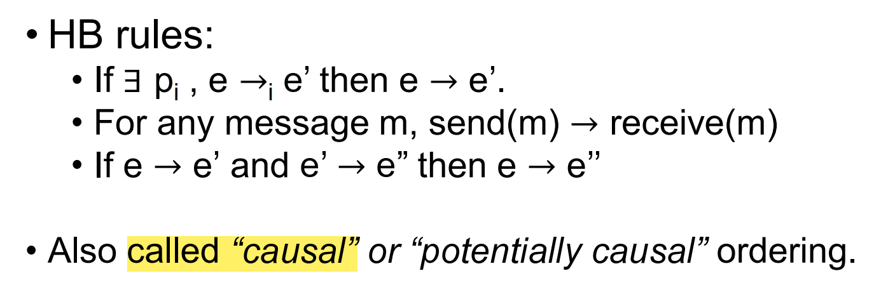

互相之间有HB的关系，说明是有先后的。

互相之间没有HB的关系，说明是并行的(Concurrent)。

### Lamport's Logical Clocks and Vector Clocks

**然后提出了两种通过数据分析Clocks的方式:**

* Lamport's Logical Clock;
* Vector Clocks;

**LLC:**

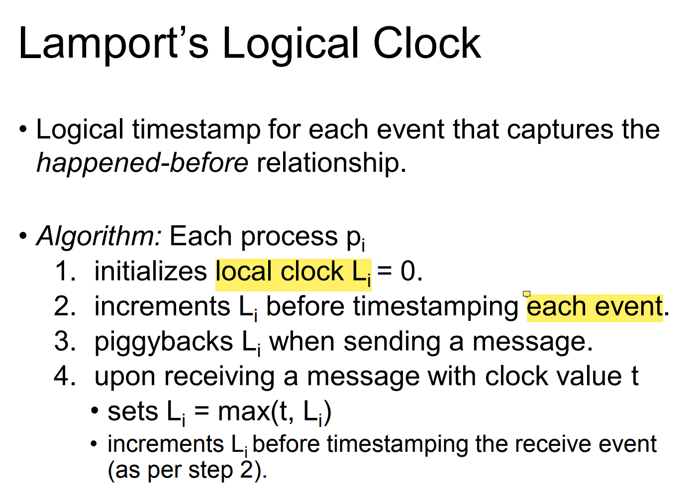

大致的原理是每一次event发生都在自己的 Local Clock加一，发送的时候带上LC。

收到信息的时候比较当前的时间和收到的信息附带的时间，选择大的作为时间。

设置当前L的时候加一再赋值。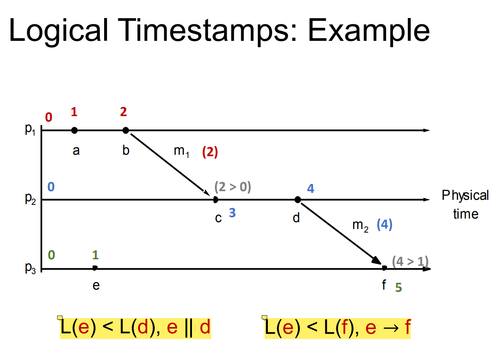

优点：

* 使用的空间小，只需要一个数字。

缺点：

* 不能通过L的大小推断全局的HB关系。L的大小可以再同一个Process内部推断HB。
* 不同的Process之间L1>L2只能证明1不比2晚。可能并行可能有前后。

**Vector Clocks:**

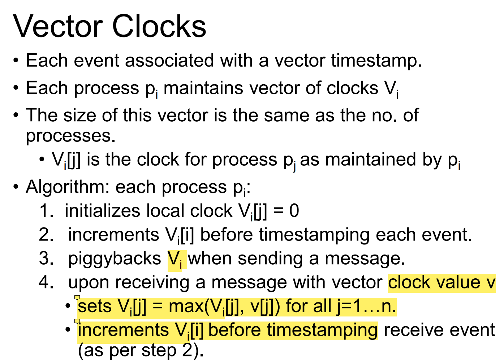

这种方法的想法：

每一个Process都有一个Vector记录所有的Process的time stamp，有n个Process length就是n.

每一次Event出现都Add自己的Time Stamp。

传输的时候都会传一个vector。

每当接受到一个信息，都将自己当前的time vector和收到的vector每一位比较，取大的那个。

然后将自己那一位的time stamp加一，这个新的vector就成为这一时间点的time vector。

优点：

* 可以通过这个Vector通过小于关系可以比较出全局的先后关系，如果没有完全小于，就是并行关系。

缺点：

* 占用空间很多，每次要进行进行比较，耗时比较大。

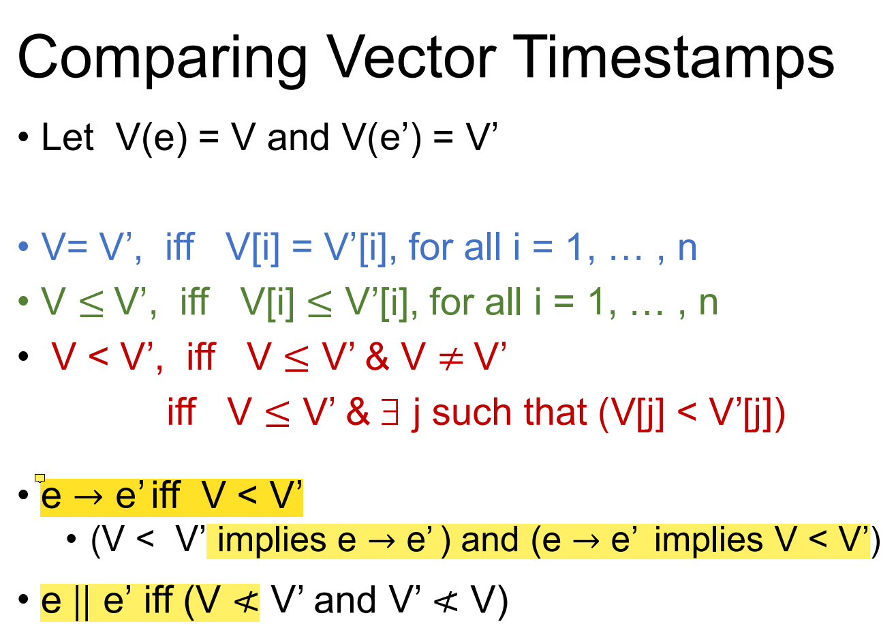

**通过小于关系可以比较全局的时间先后关系。**

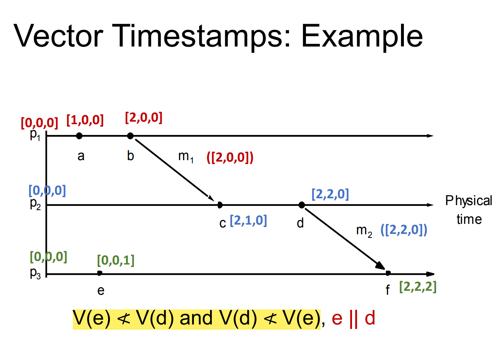

****

**如果没有完全小于，就是并行关系。**

### 总结：

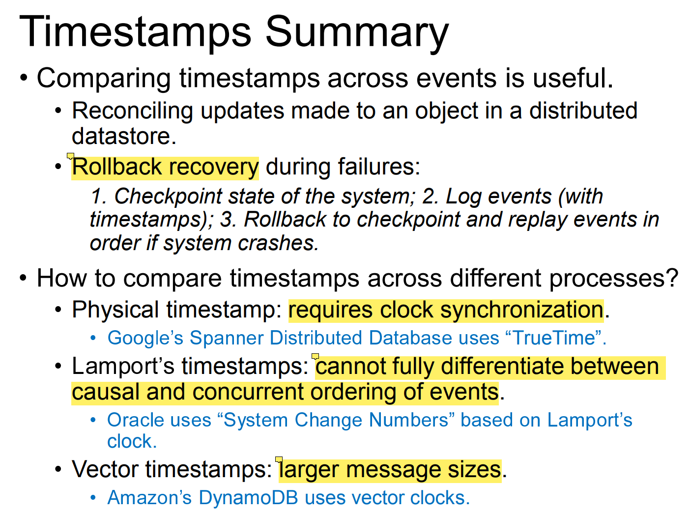

## lecture 5

**内容概括：**😊

如何让记录全局的状态并且不用Time Synchronization.

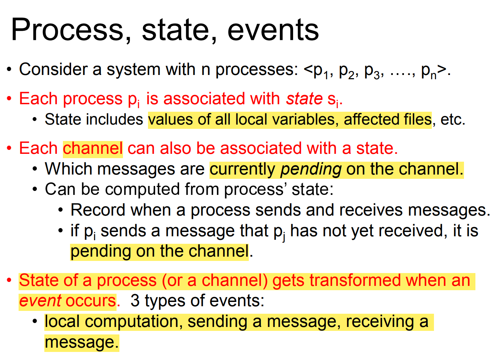

### 全局的信息：

* 所有的节点(Process)和节点的内部信息(Local variable, files)
* 所有的channel，每一个节点有发送口和接收口。pending在channel中的信息。

状态State在Events出现的时候会改变。

### CUT

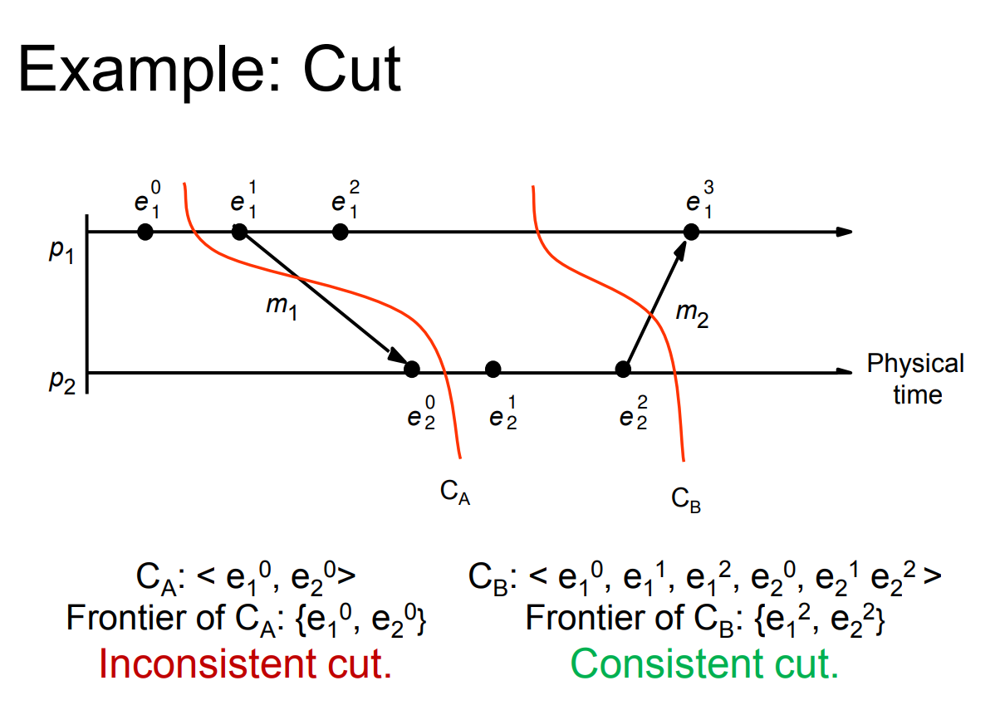

**内容：**

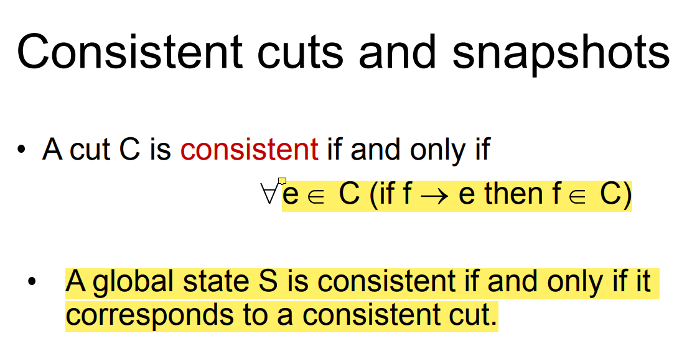

CUT 是否consistent很重要，就像上面所说，一个全局的状态S只有在他对应一个consistent CUT

的时候才是consistent的。

* 对于简而言之，在一个Consistent CUT中不能出现违反HB的发送线路（接收端在CUT内部（左侧），发送端在CUT外部（右侧）。
* 也就是上面公式所说的：对于任意C内部的节点e，如果有f比e发生的早，那f也在CUT中。

**那我们应该怎么找到Consistent Cut呢？于是就引出了CL算法**

*参考链接：*[分布式快照算法: Chandy-Lamport 算法 - 知乎 (zhihu.com)](https://zhuanlan.zhihu.com/p/53482103)

### Chandy-Lamport Algorithm

这个算法的目标就是为了找到Consistent的Cut。

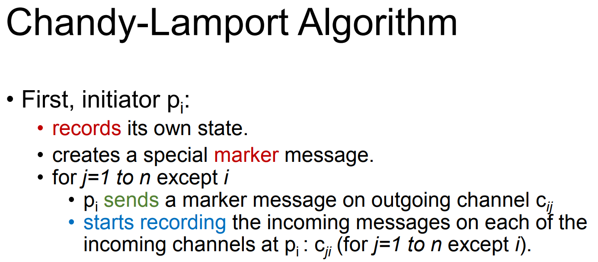

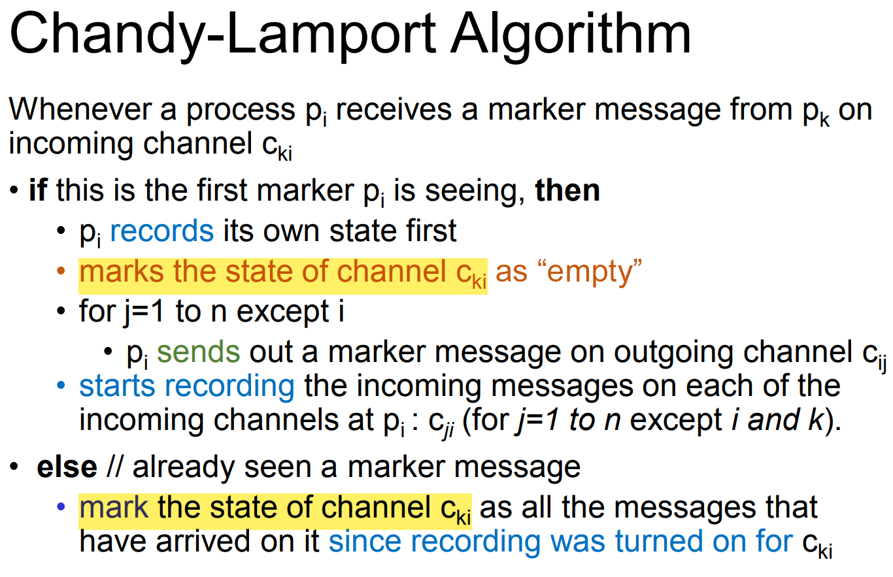

**内容：**

这个算法很Intuitive，感觉难点在于对于Channel的操作。

**在发送Marker方面：**

* 一个Process先记录自己的State。
* 然后发出一个Marker给其余的所有Process，并且开始记录所有的受信息Channel(直到收到这个Channel的Marker)。

**对于其余的收到Marker的Process：**

如果第一次：

* 记录自己的State。（完成对于当前时间点的快照）
* 将发送来Marker的Channel记录为空。（这个process已经完成快照了，不会再有新的信息算在CUT中了。）
* 发送Marker给==所有的Process==，并且开始记录剩余的Channels（直到收到这个channel的Marker）。（Recording收到的消息是算在CUT中，也就是marker收到之前发出的消息）

如果不是第一次：

* 把这个发送Marker的Channel设为空（不继续记录这个channel，也就是这个Channel收到的剩余信息不算在CUT之内）。


这个算法的难点在于对于channel的动作，总结来说就是第一次收到Channel持续收听还没收到的marker的channel。之后收到的marker，不继续记录marker来的channel。（如果收到从Pk来marker，就将从k发消息的channel设为空。）

这样操作的原因的前提在于信息在Channel中的传输的FIFO的（在一个process快照前发出的消息一定在marker之前收到），如果不是FIFO这个算法没办法满足因果性。

**总结一下：** 一个process先完成local的快照再发送marker给别的process。 每一个收到marker的process都先记录local快照，然后向所有的process发送marker。算法到最后一个process完成本地快照，然后所有process收到除自己外所有的marker就结束。**注意：**在算法没结束，所有process都可以在发送marker之后继续发送信息，但是这些信息不会被record。因此CL算法不打断分布式系统的运行，并且记录下consistent的global shot.

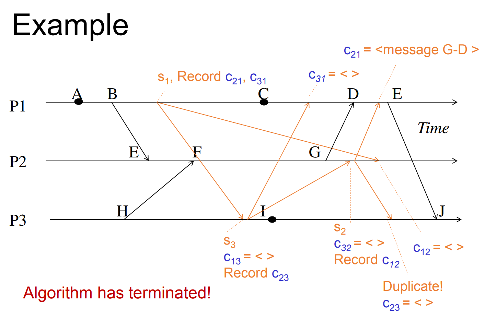

可以参开这个图片中的Channel记录。cij = <>就是把一个Channel设为空。


### 总结：


我有一个问题？？

这个Consistent的Global State是怎么汇聚起来。是在CL algorithm结束之后每个Process把自己的Local Cut全部汇聚到Center然后公开访问吗？？？？


## lecture6

**内容概括：**😊

这节课也是关于CL Algorithm的一些性质。

### Run和Linearization

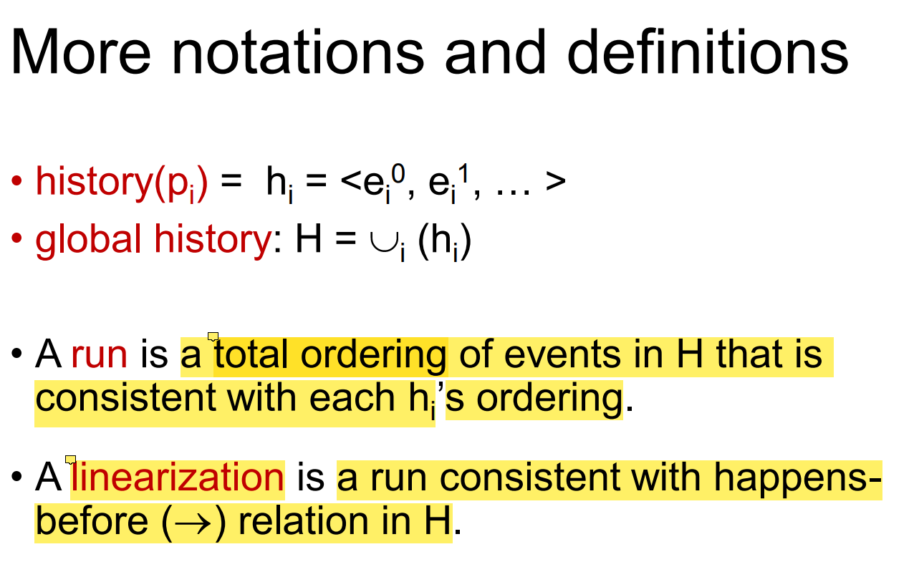

**history(pi):**

h(p)指的是一个process发生的event记录，有顺序哦。满足h(p)**内部顺序**的total ordering就是run。

**global history：**

H指的是所有的process记录的events并集。Linearization比run更加苛刻的地方就在于它需要满足process之间events的HB顺序。

**Run：**

* Run是一个全序（全序中每一个元素都可以比较。也就是每一个状态都可以比较！(这一点是满足的，每个State都是可比的)））
* Run要符合h的ordering，也就是要符合一个Process**内部事件发生先后**的时序性。(这条可能不满足，要满足Process内部的因果关系（causality）)

**Linearization:**

* Linearization是一种更苛刻的Run。不仅要求满足Run的性质。还有自己的性质。
* Linearization要求满足H的ordering(HB)也就是**Process之间的因果关系（先收再发）**。
* 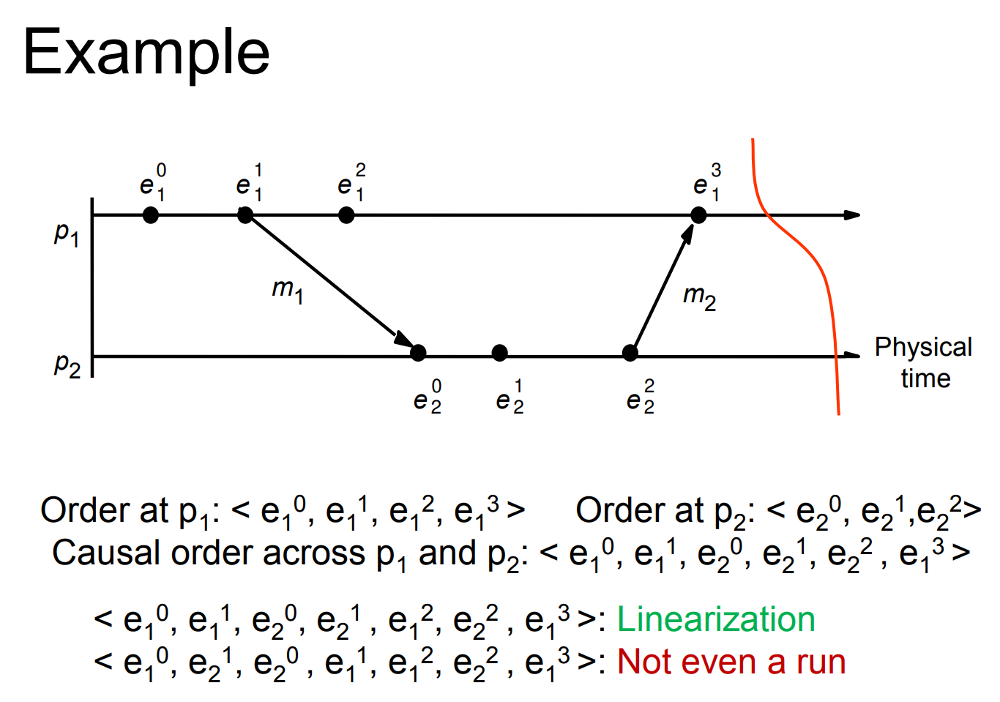

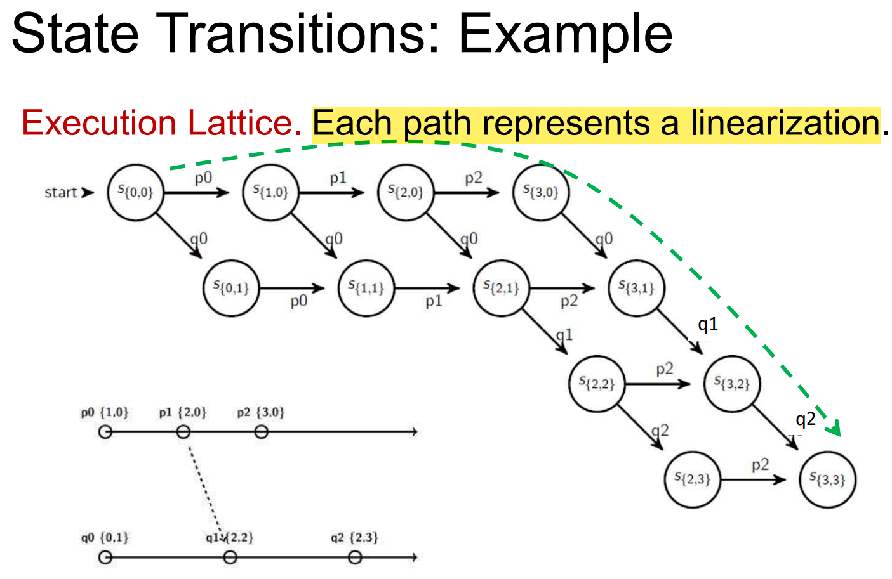

在这个图上的所有路径都是Linearization的路径（只要不先q1再p1就行）。

### 总结：

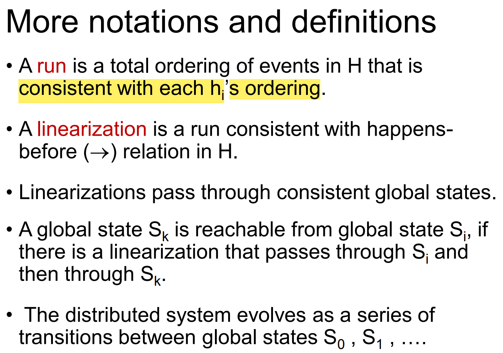

## lecture 7

**内容概括：**😊

这个课引入并且介绍了了Multicast。目的是在一个group之间传输数据。

首先介绍了三种Communication的方式：

* Unicast： 从一个Process到另一个Process
* Broadcast： 从一个Process到这个network中的所有Process
* Multicast： 在一个group中broadcast。

Multicast在现实生活中的使用很广泛，例如发朋友圈会同步在所有的朋友的手机界面中，国际排名会在网络内同步等等。实现可靠的Multicast是很重要的。


### Basic Multicast(B-Multicast)

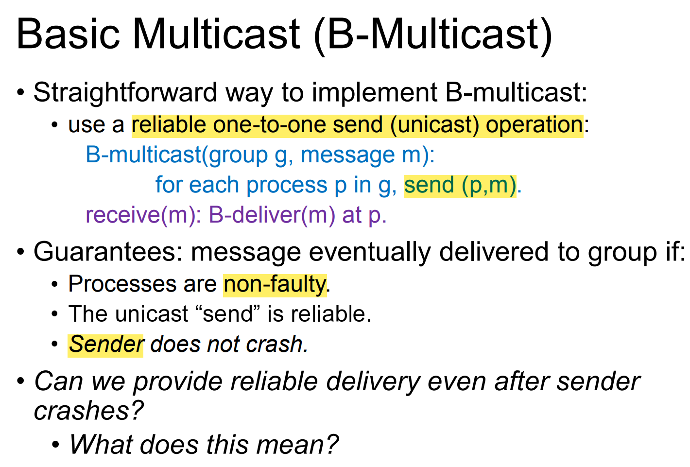

**内容：**B-Multicast是很直白的，对于Group内的每一个Process，Unicast信息。

* B-Multicast不是Reliable的，当Sender给group的subset发送了Unicast时，如果fail了，别的无法收到。

### Reliable Multicast(R-Multicast)

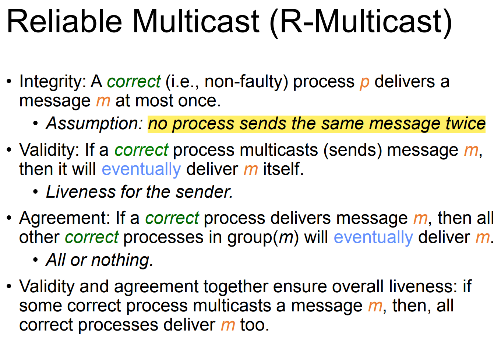

**内容：**

* Validity： 如果一个Process Multicast了m，那他自己一定会收到m。

* Agreement： 如果一个正确的Process收到了m那在这儿group中的所有Process都会收到m。

这个不是很懂。这个几个性质之间的关系。

### Implementing R-Multicast

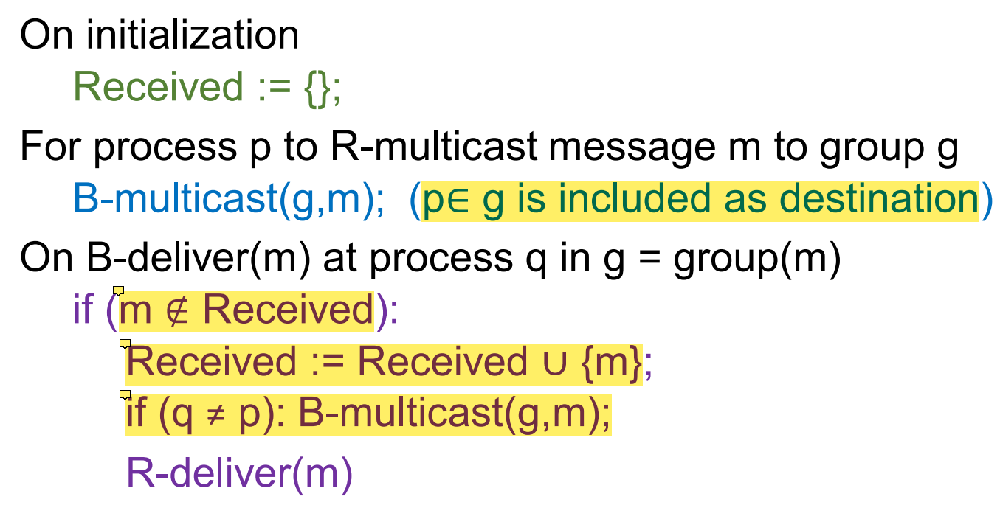

一开始的时候，大家的Received都是空，也就是没有收到过m。

**发送的Process：**

Process做B-Multicast(g,m)对于group中的每一个Process（包括自己）发送。

**接收的Process：**

如果收到的m不在Receive中（之前没有收到过）

* 将m加入Received
* 如果不是自己给自己发的，就再做B-Multicast(g,m);
* 收到m

### Ordered Multicast

分为三种有序的Multicast：

* FIFO Ordering
* Causal Ordering
* Total Ordering

#### FIFO Ordering

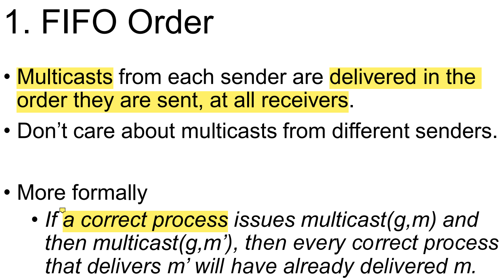

从==同一个Sender==发出的Multicast，这些信息在接收**Receiver收到的顺序**和**信息在Sender发出的顺序**相同。

**EXAMPLE:**

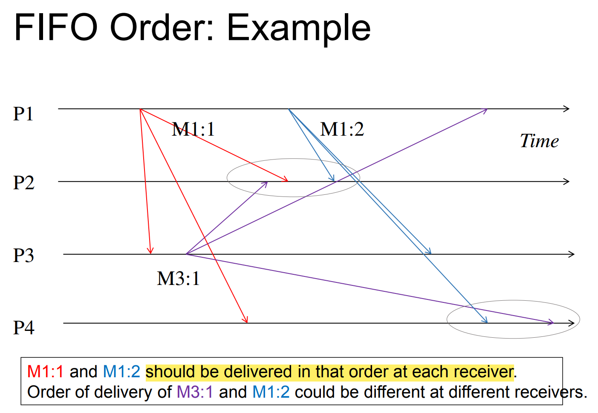

#### Causal Order

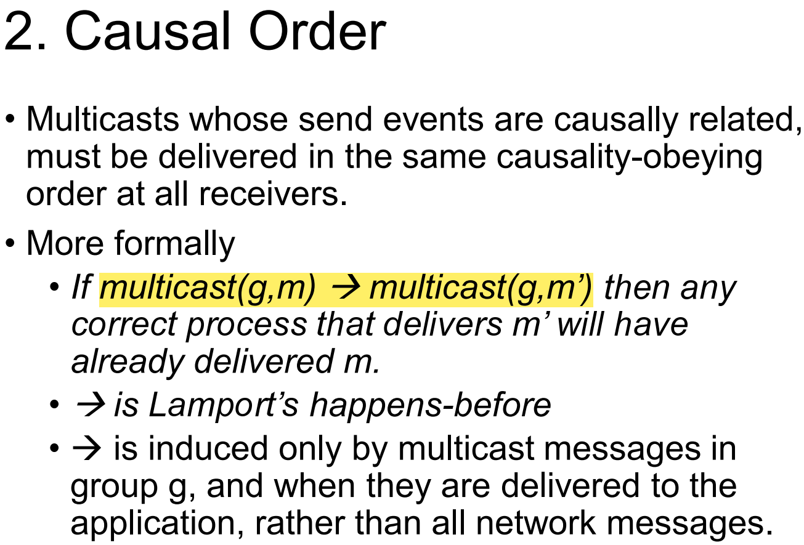

Causal Ordering已经符合了FIFO Ordering。它要求所有有HB关系的Multicast在Receiver处收到的顺序不能违背HB的顺序。

**EXAMPLE:**

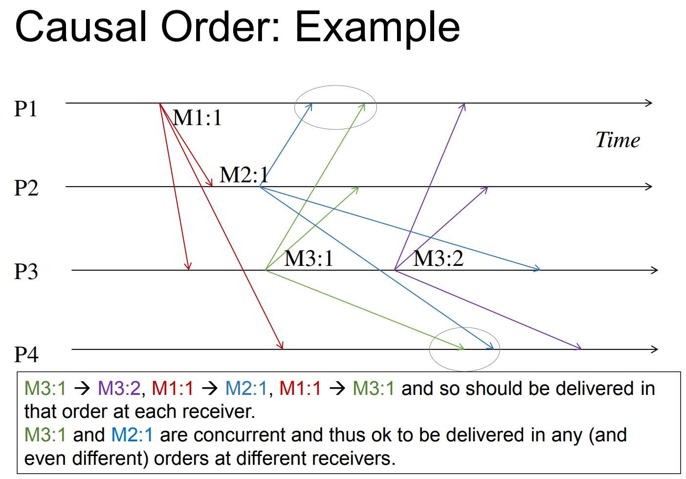

#### Total Order:

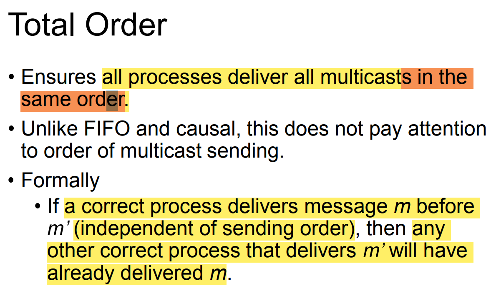

所有的Process收到信息的顺序都一样。（不用管Sender发出的顺序）

**EXAMPLE：**

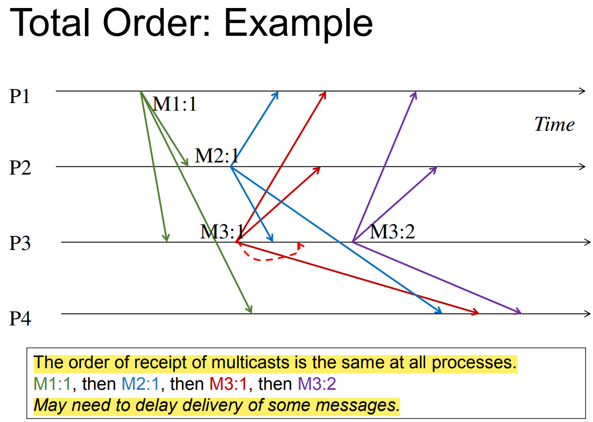

**Total Ordering 和 Causal Ordering之间相互不能推导！**

### 总结：

这节课的内容都是关于Multicast以及Ordered Multicast的。

首先介绍了 Multicast的概念，以及介绍了Basic-Multicast。

为了获取Reliable的Multicast，介绍了R-Multicast的实现。

然后介绍了三种Ordered Multicast。分别介绍了他们的顺序要求；

## lecture 8

**内容概括：**😊

这节课内容主要关于三种Ordered Multicast的具体实现。

### FIFO Ordering的实现

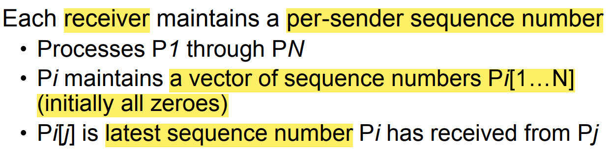

每一个Process都有一个vector记录每一个P的sequence_number. 这个P的Sequence_number在收发的时候都有作用的！发送的时候，把对应自己的数字加一，将vector和信息一起发送。

**这个每个Pi[i]就是Pi发送的信息个数加上自己给自己deliver的信息个数和！**

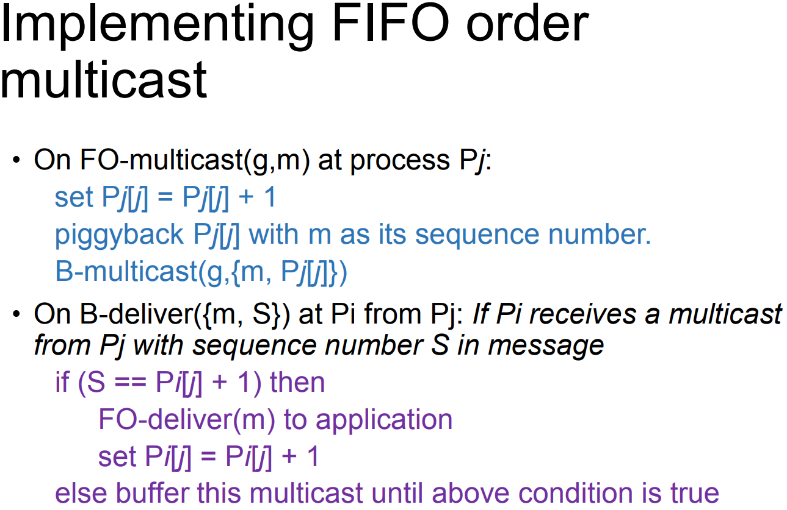

**内容：**

* 这个算法很好懂！为了满足FIFO的要求，用sequence_number记录。如果收到的信息不应该是发送的P的下一个信息，那就buffer起来，直到deliver了P之前发送的信息再deliver现在的信息。

	**example：**

	

### Total Ordering的实现

**内容：**Total ordering是为了每一个Process都按照相同的顺序接收到multicast。Total Ordering的实现有两种方法：

* Centralized sequencer

*  Decentralized mechanism(ISIS)

**1. Centralized Sequencer:**

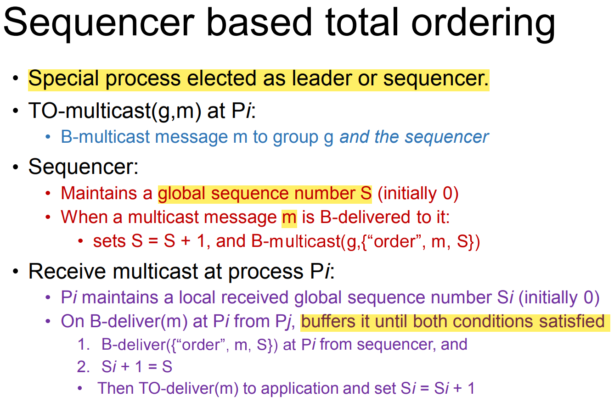

感觉这个算法实现起来也很trivial。

使用Leader，也就是centralized Sequencer**记录自己收信息的顺序编号S**，然后将信息m和顺序编号S一起multicast给别的P。

每一个Pi（不是Leader）都有一个自己的顺序编号Pi。**Pi收到m先buffer起来**，直到收到Sequencer发送的信息，如果这个信息的顺序编号是Si+1,说明这个信息应该是Leader顺序下的下一个信息，就接收这个信息，Si=Si+1。

**2. ISIS:**

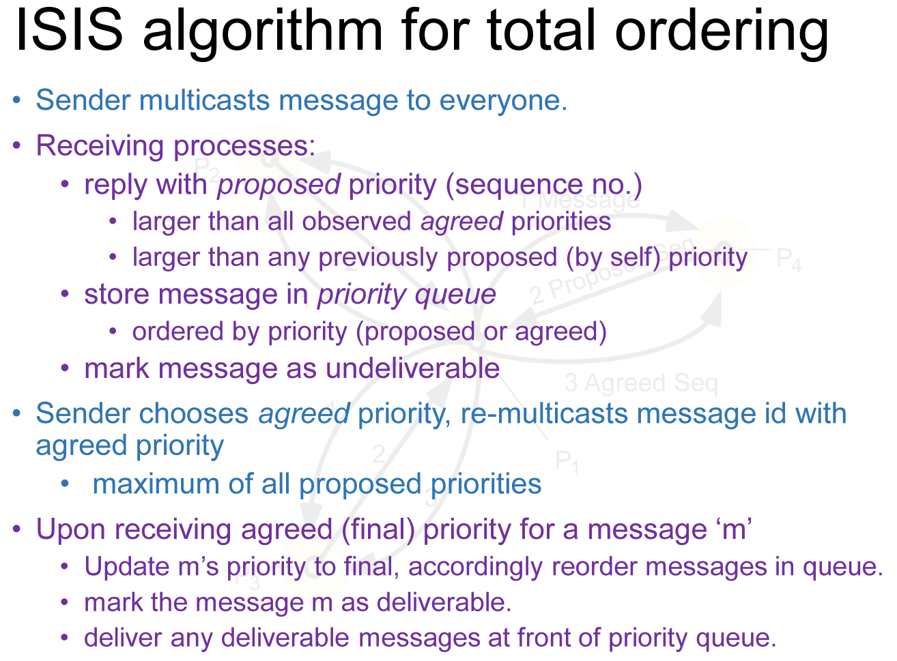

这个算法是Decentralized的，也就是没有一个Leader来做决定。

Sender直接Multicast信息给每个人。

收到信息之后，Group中每一个P**回复一个他自己提出的Priority**，且满足：

* 比之前所有**见过的Priority都要大**
* 比他曾经**提出过的Priority都要大**

将信息**存在Priority Queue**里面，key是信息的Priority。标记信息undelivered。

Sender收到P提出来的很多Priority，选择**最大的Priority**作为这个message agree的Priority， re_multicast给Group。

收到Final agree的Priority之后，**“将这个message的Priority更新**，将这个优先队列reorder，**标记这个信息delivered**。

如果优先队列中的**第一个信息是delivered，就将他deliver**。

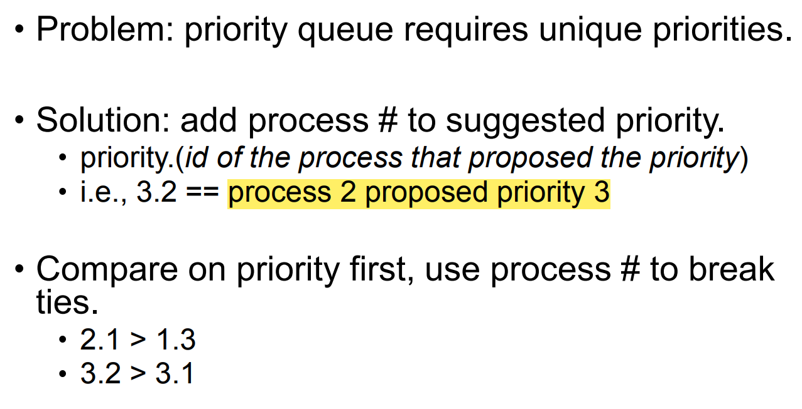

**如果出现平局的Priority，将Process的id加入Priority来Break Tie**

### 总结：

Casual Ordering还没写，之后整理在lecture8中。

总体来说，三种Ordered Multicast都比较好理解，看看就能看懂。

FIFO和Total使用的方法也很类似。

* FIFO记录**每个P的Sequence_number来保证同一个P发送的multicast的顺序性**。 

* Total_Ordering通过**Centralize和选择最大Priority的方式**保证每一个P的收到信息顺序一致。


# MP

### MP0

目标：

create a simple network application

Task1:

做一个logger 从多个nodes中获得信息。

这个MP使用socket实现了远程连接通信。是使用python实现的socket连接。

> **实现内容：**使用socket编程，实现远程通信和信息记录。主要是并行的线程，使用多线程实现多个node和logger的通信。
>
> **思想概括：**
>
> **实现的难点：**
>
> 1：*多node需要多线程。*
>
> 在这个MP中我在task2中通过全局变量实现对于logger的delay信息分析记录，在分布式系统的问题中最好不要使用全局变量进行记录。可能会产生资源竞争的问题，需要用到锁来避免共享资源的竞争。所以最好不要使用全局变量进行记录。但是使用python的Thread.threading(target = Function, args = ....)函数无法获取到线程函数的返回值，如果需要返回值信息，可以使用线程池获取。
>
> **在整理的时候我想起来ECE438的MP实现多任务并行使用的是fork，是创造了一个新的进程，而threading是创造了一个新的线程（不同线程之间共享数据，交互方便，但是容易产生竞争问题）。关于fork和thread，之后可能再进行整理。**
>
> 2 ：*在Linux中并行运算的命令使用*
>
> 在这个MP需要使用到Linux中的管道操作|和Linux中的并行运算操作&。
>
> 使用管道操作可以将前一个函数的输出作为后一个函数的输入。
>
> 使用并行运算符& 可以并行地运算多个进程。
>
> *3： python写入和读取txt文件*
>
> open(“file directory”, mode ="r") 读文件的时候使用
>
> ```python
> #读文件
> file = open("directory",mode="r" )
> data = []
> for line in fine:
> 	data_line = line.strip("\n")
>     data.append(int(data_line))#可能是float(data_line)
> file.close
> ```
>
> open(“file directory”, mode ="w+") 能写 但是每次写都会覆盖
>
> open(“file directory”, mode ="a+") 可以写，每次写不会覆盖，但是不能读。
>
> ```python
> file = open("directory",mode="r" )
> file.write("\n"+str("things to write"))
> file.close
> ```
>
> *4：使用matplotlib画图*
>
> 可以使用基本的模板进行画图。
>
> ```python
> import matplotlib.pyplot as plt
> x_list = np.arange(0.1,1.1,0.1)
> y_list = delay_data #.....
> 
> plt.figure()
> plt.xlabel("X axis")
> plt.ylabel("y axis")
> plt.plot(x_list,y_list)
> plt.savefig(fname = "Graph")
> plt.show()
> ```
>
> 

#### ==代码实现== :happy:

```c++
int main(){
  return 0;
}
```

#### 知识点整理:up:

* ....
* ....

#### 难点回顾:sagittarius:

```text

```


