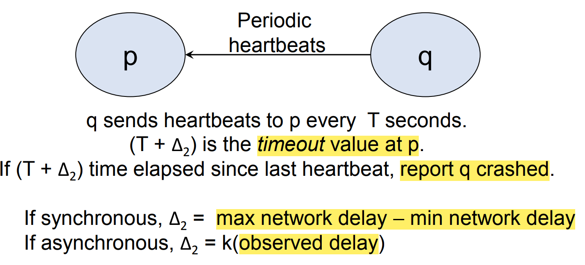

# 这是关于ECE428的一个Markdown的记录

# 课程内容整理：

前三个lecture没有整理。。。。。

[toc]


## lecture Template

**内容概括：**😊


### 知识点1

**内容：**

* 
* 

### 知识点2

**内容：**

* 
* 

### 总结：


## lecture 2

**内容概括：**😊

这节课是比较general的内容。


首先讲解了分布式系统中的三个重要部分：

* Processes之间通过通信来互相交流
* 不同的Process之间有不同的clocks
* Process和communication会fail

### Communication Prorperty

**Latency：**

* 传输端发送信息的时间和接收端接收信息的时间差

**Bandwidth：**

* 单位时间channel传输的信息量。（多个channel公用一个network link，bandwidth会变小）

### Different clocks


**Synchronous distributed system and Asynchronous distributed system：**

* 同步系统，每一个步骤都有确定的上下限。发送信息和clock drift都有上下限。
* 异步系统，没有任何上下限。信息接收,drift rate没有时间的限制。

**在现实生活中，大多数是异步系统，Bound是估计出来的。可以假设系统是同步系统进行分析。**

### Failure

**Process may crash，这里给出了两种方法进行detect crashed process的方法：**

#### Periodic Ping and Ack


p向q周期性发送ping，q收到ping回复q。如果p发送信号会做倒计时。时间结束还没有收到回复，那么q crashed了。这个时间根据不同系统不相同。

#### Periodic heartbeats:



q周期性向p发送heartbeats。p每次收到heartbeats之后会做倒计时，要是时间到了还没有收到新的heartbeats就说p crashed了。

#### Correctness of failure detection:

**Completeness:**

* 所有fail的Process都被发现

**Accuracy:**

* 所有detected的failure都是真正crashed的process

#### Correctness of failure detection and systems：


**对于异步系统，fail detection不可能有既完备又准确的算方法。**

#### Metrics for failure detection:

**Worst case failure detection time:**

一个算法验证crash的最坏情况。往往都是发送信息的Process一发出自己存活的信息后立刻死亡，就有了最坏的情况。


：

**Bandwidth:这个算法占用的带宽：**


### 总结：

这节课讲了分布式系统的主要概念和几个重要的问题。这几个主要问题之后会常常用到：

* Communication time

* 同步和异步系统

* failure detection

## lecture 3

**内容概括：**😊

这节课是关于failure detection的延续和time and clock的内容。

### Extending heartbeats

**内容：**

之前我们通过heartbeat和Periodic Ping进行了两个Process之间的crash检测。这节课将从两个点延申到一群点：


​												**Server接收每一个点定时的heartbeat**


​						a				**Ring通过下一个接受前一个的heartbeat**


​								**每一个人接收别的所有人的heartbeat，但是bandwidth占用很多**

### Time and Clocks

**内容：**

时钟的一致是很重要的，在一个系统里如果需要时间的同步就需要Process之间时钟的一致性。

**Clock的两个概念：**

* Clock Skew:

Clock Skew指的是不同Process的时钟数值的差距。(单位是s)

* Drift Rates

Drift Rates指的是不同Process的时钟频率的差距。(单位是s/s)也就是每秒造成多少秒的不同。


### Synchronization:


这就引出了一个评价Synchronization的标准：Synchronization Bound。也就是两个Process之间的时间值差距。


当client收到Server传来的时间之后需要在收到的时间之后加上一定的时间。这个加的时间不同，bound就是不同。

#### 三种在Asynchronous System中 Synchronization的方法


**Cristian Algorithm：**


Client收到时间之后。他需要measure信息来回的时间，加上这个时间的一半。

右边的是两种极端情况，也就是发送的时间是min或者发回来的时间是min。

**这个算法可以通过按照一定时间间隔发送Request。使用收到Response中Tround最小的来确定时间。**

**Berkeley Algorithm:**

这个算法只能Internal Synchronization


* Server收到各个Clients的时间值。

* Server对于收到的每一个时间使用Cristian算法。
* Server Average各个时间作为最终的时间
* Server给每一个Clients广播他们和最终时间的相对值

**Berkeley算法要Average各个Clients，为了防止错误的时间影响，他只处理在一定范围内的时间。**

**Network Time Protocol：**


Client发送和收到信息都会记录下时间，发送信息的时候会把记录的时间一起发送。这样收到信息的Process就可以知道信息处理的事件，信息发送的时间，两个Process的时间差。

### 总结：

主要是关于三种Synchronization的方法：


## lecture4

**内容概括：**😊

在Lecture3中我们使用了多种方法在物理层面(**Physical Timestamp**)上完成了**clock synchonization**.

Lecture4中尝试使用数据记录来获得时间的先后信息而不是准确的物理时间。

***Can we reason about the order of events without synchronized clocks?***

尝试**不使用**synchronized clocks来完成events的排序。

那怎么排呢？ 使用几个变量进行描述： **Process， state， events**.

每一个Process每一时刻都有自己的state进行描述。

**Events总共有三种：**

* Process内部计算
* Process发送信息
* process收到信息

每一次有Events发生，都会附带State的更新，来新的Process状态。

### HB

**首先提出HB(Happen-Before)(Casual Ordering)的Event Ordering概念：**

e->e' 指的是e比e’先发生。 


互相之间有HB的关系，说明是有先后的。

互相之间没有HB的关系，说明是并行的(Concurrent)。

### Lamport's Logical Clocks and Vector Clocks

**然后提出了两种通过数据分析Clocks的方式:**

* Lamport's Logical Clock;
* Vector Clocks;

**LLC:**


大致的原理是每一次event发生都在自己的 Local Clock加一，发送的时候带上LC。

收到信息的时候比较当前的时间和收到的信息附带的时间，选择大的作为时间。

设置当前L的时候加一再赋值。

优点：

* 使用的空间小，只需要一个数字。

缺点：

* 不能通过L的大小推断全局的HB关系。L的大小可以再同一个Process内部推断HB。
* 不同的Process之间L1>L2只能证明1不比2晚。可能并行可能有前后。

**Vector Clocks:**


这种方法的想法：

每一个Process都有一个Vector记录所有的Process的time stamp，有n个Process length就是n.

每一次Event出现都Add自己的Time Stamp。

传输的时候都会传一个vector。

每当接受到一个信息，都将自己当前的time vector和收到的vector每一位比较，取大的那个。

然后将自己那一位的time stamp加一，这个新的vector就成为这一时间点的time vector。

优点：

* 可以通过这个Vector通过小于关系可以比较出全局的先后关系，如果没有完全小于，就是并行关系。

缺点：

* 占用空间很多，每次要进行进行比较，耗时比较大。


**通过小于关系可以比较全局的时间先后关系。**


****

**如果没有完全小于，就是并行关系。**

### 总结：


## lecture 5

**内容概括：**😊

如何让记录全局的状态并且不用Time Synchronization.


### 全局的信息：

* 所有的节点(Process)和节点的内部信息(Local variable, files)
* 所有的channel，每一个节点有发送口和接收口。pending在channel中的信息。

* 状态State在Events出现的时候会改变。

### CUT


**内容：**


CUT 是否consistent很重要，就像上面所说，一个全局的状态S只有在他对应一个consistent CUT

的时候才是consistent的。

* 对于简而言之，在一个Consistent CUT中不能出现违反HB的发送线路（接收端在CUT内部（左侧），发送端在CUT外部（右侧）。
* 也就是上面公式所说的：对于任意C内部的节点e，如果有f比e发生的早，那f也在CUT中。

**那我们应该怎么找到Consistent Cut呢？于是就引出了CL算法**

*参考链接：*[分布式快照算法: Chandy-Lamport 算法 - 知乎 (zhihu.com)](https://zhuanlan.zhihu.com/p/53482103)

### Chandy-Lamport Algorithm

这个算法的目标就是为了找到Consistent的Cut。


**内容：**

这个算法很Intuitive，感觉难点在于对于Channel的操作。

**在发送Marker方面：**

* 一个Process先记录自己的State。
* 然后发出一个Marker给其余的所有Process，并且开始记录所有的受信息Channel(直到收到这个Channel的Marker)。

**对于其余的收到Marker的Process：**

如果第一次：

* 记录自己的State。（完成对于当前时间点的快照）
* 将发送来Marker的Channel记录为空。（这个process已经完成快照了，不会再有新的信息算在CUT中了。）
* 发送Marker给==所有的Process==，并且开始记录剩余的Channels（直到收到这个channel的Marker）。（Recording收到的消息是算在CUT中，也就是marker收到之前发出的消息）

如果不是第一次：

* 把这个发送Marker的Channel设为空（不继续记录这个channel，也就是这个Channel收到的剩余信息不算在CUT之内）。


这个算法的难点在于对于channel的动作，总结来说就是**第一次收到Channel持续收听还没收到的marker的channel**。之后收到的marker，不继续记录marker来的channel。（如果收到**从Pk来marker**，就将**从k发消息的channel设为空**。）

这样操作的原因的前提在于信息在Channel中的传输的FIFO的（**在一个process快照前发出的消息一定在marker之前收到**），如果不是FIFO这个算法没办法满足因果性。

**总结一下：** 一个process==先完成local的快照再发送marker给别的process==。 ==每一个收到marker的process都先记录local快照，然后向所有的process发送marker==。算法到最后一个process完成本地快照，然后==所有process收到除自己外所有的marker就结束==。**注意：**==在算法没结束，所有process都可以在发送marker之后继续发送信息，但是这些信息不会被record==。因此CL算法不打断分布式系统的运行，并且记录下consistent的global shot.


可以参开这个图片中的Channel记录。cij = <>就是把一个Channel设为空。


### 总结：


我有一个问题？？

这个Consistent的Global State是怎么汇聚起来。是在CL algorithm结束之后每个Process把自己的Local Cut全部汇聚到Center然后公开访问吗？？？？


## lecture6

**内容概括：**😊

这节课也是关于CL Algorithm的一些性质。

### Run和Linearization


**history(pi):**

h(p)指的是一个process发生的event记录，有顺序哦。满足h(p)**内部顺序**的total ordering就是run。

也就是说run里面包含了多个events，并且run中的顺序满足了每一个p的内部顺序（满足了P内部的causal order）。

**global history：**

H指的是所有的process记录的events并集。Linearization比run更加苛刻的地方就在于它需要满足process之间events的HB顺序。

**Run：**

* Run是一个全序（全序中每一个元素都可以比较。也就是每一个状态都可以比较！(这一点是满足的，每个State都是可比的)））
* Run要符合h的ordering，也就是要符合一个Process**内部事件发生先后**的时序性。(这条可能不满足，要满足Process内部的因果关系（causality）)

**Linearization:**

* Linearization是一种更苛刻的Run。不仅要求满足Run的性质。还有自己的性质。
* Linearization要求满足H的ordering(HB)也就是**Process之间的因果关系（先收再发）**。
* 


在这个图上的所有路径都是Linearization的路径（只要不先q1再p1就行）。

### 总结：


## lecture 7

**内容概括：**😊

这个课引入并且介绍了Multicast。目的是在一个group之间传输数据。

首先介绍了三种Communication的方式：

* Unicast： 从一个Process到另一个Process
* Broadcast： 从一个Process到这个network中的**所有Process**
* Multicast： 在一个group中broadcast。

Multicast在现实生活中的使用很广泛，例如发朋友圈会同步在所有的朋友的手机界面中，国际排名会在网络内同步等等。实现可靠的Multicast是很重要的。


### Basic Multicast(B-Multicast)


**内容：**B-Multicast是很直白的，对于Group内的每一个Process，Unicast信息。

* B-Multicast不是Reliable的，当Sender给group的subset发送了Unicast时，如果fail了，别的无法收到。

### Reliable Multicast(R-Multicast)


**内容：**

* Validity： 如果一个Process Multicast了m，那他自己一定会收到m。

* Agreement： 如果一个正确的Process收到了m那在这儿group中的所有Process都会收到m。

这个不是很懂。这个几个性质之间的关系。

### Implementing R-Multicast


一开始的时候，大家的Received都是空，也就是没有收到过m。

**发送的Process：**

Process做B-Multicast(g,m)对于group中的每一个Process（包括自己）发送。

**接收的Process：**

如果收到的m不在Receive中（之前没有收到过）

* 将m加入Received
* 如果不是自己给自己发的，就再做B-Multicast(g,m);
* 收到m

### Ordered Multicast

分为三种有序的Multicast：

* FIFO Ordering
* Causal Ordering
* Total Ordering

#### FIFO Ordering


从==同一个Sender==发出的Multicast，这些信息在接收**Receiver收到的顺序**和**信息在Sender发出的顺序**相同。

**EXAMPLE:**


#### Causal Order


Causal Ordering已经符合了FIFO Ordering。它要求所有有HB关系的Multicast在Receiver处收到的顺序不能违背HB的顺序。

**EXAMPLE:**


#### Total Order:


所有的Process收到信息的顺序都一样。（不用管Sender发出的顺序）

**EXAMPLE：**


**Total Ordering 和 Causal Ordering之间相互不能推导！**

### 总结：

这节课的内容都是关于Multicast以及Ordered Multicast的。

首先介绍了 Multicast的概念，以及介绍了Basic-Multicast。

为了获取Reliable的Multicast，介绍了R-Multicast的实现。

然后介绍了三种Ordered Multicast。分别介绍了他们的顺序要求；

## lecture 8

**内容概括：**😊

这节课内容主要关于三种Ordered Multicast的具体实现。

### FIFO Ordering的实现


每一个Process都有一个vector记录每一个P的sequence_number. 这个P的Sequence_number在收发的时候都有作用的！发送的时候，把对应自己的数字加一，将vector和信息一起发送。

**这个每个Pi[i]就是Pi发送的信息个数加上自己给自己deliver的信息个数和！**


**内容：**

* 这个算法很好懂！为了满足FIFO的要求，用sequence_number记录。如果收到的信息不应该是发送的P的下一个信息，那就buffer起来，直到deliver了P之前发送的信息再deliver现在的信息。（i到j的信息传输只管维护i到j的大小顺序）

	**example：**

	

### Total Ordering的实现

**内容：**Total ordering是为了每一个Process都按照相同的顺序接收到multicast。Total Ordering的实现有两种方法：

* Centralized sequencer

*  Decentralized mechanism(ISIS)

**1. Centralized Sequencer:**


感觉这个算法实现起来也很trivial。

使用Leader，也就是centralized Sequencer**记录自己收信息的顺序编号S**，然后将信息m和顺序编号S一起multicast给别的P。

每一个Pi（不是Leader）都有一个自己的顺序编号Pi。**Pi收到m先buffer起来**，直到收到Sequencer发送的信息，如果这个信息的顺序编号是Si+1,说明这个信息应该是Leader顺序下的下一个信息，就接收这个信息，Si=Si+1。

**2. ISIS:**


这个算法是Decentralized的，也就是没有一个Leader来做决定。

Sender直接Multicast信息给每个人。

收到信息之后，Group中每一个P**回复一个他自己提出的Priority**，且满足：

* 比之前所有**见过的Priority都要大**
* 比他曾经**提出过的Priority都要大**

将信息**存在Priority Queue**里面，key是信息的Priority。标记信息undelivered。

Sender收到P提出来的很多Priority，选择**最大的Priority**作为这个message agree的Priority， re_multicast给Group。

收到Final agree的Priority之后，**“将这个message的Priority更新**，将这个优先队列reorder，**标记这个信息delivered**。

如果优先队列中的**第一个信息是delivered，就将他deliver**。


**如果出现平局的Priority，将Process的id加入Priority来Break Tie**

### 总结：

Casual Ordering还没写，之后整理在lecture8中。

总体来说，三种Ordered Multicast都比较好理解，看看就能看懂。

FIFO和Total使用的方法也很类似。

* FIFO记录**每个P的Sequence_number来保证同一个P发送的multicast的顺序性**。 

* Total_Ordering通过**Centralize和选择最大Priority的方式**保证每一个P的收到信息顺序一致。


## lecture 9

**内容概括：**😊

在Lecture8中，我们学习了FIFO Ordering和Total Ordering的实现。Lecture9中将会学习剩下的Causal Ordering的实现。

### Causal Ordering


**内容：**

* 这个算法和FIFO Ordering有一点像。它维护了一个vector，里面记录的Process信息传递的值，用来满足Causal Ordering。可以比较前面FIFO Ordering，它需要多满足的是第三个黄色的句子，满足了Process之间的HB关系。

**我的理解：**

第一点很好理解，就是满足了FIFO Ordering，满足了从P发过来的事件接收的时序性。

V[k]是**发过来的vector**（里面的数字所代表的发送事件的时间都HB当前发送的j事件）
Pi[k]是接收方**自己维护的vector**
如果满足V的**每一个都小于等于P**，那说明P已经将所有HB当前的j事件的都收到了。(FIFO Ordering没有满足这个条件)
如果不满足，那说明**j之前发送的事件有还没有被收到的**，就要buffer住。

**example:**


### multicast  mechanisms

我们刚刚实现的Multicast内部细节是Sender将massage Unicast给每一个要Multicast的成员。但事实上，Node的连接可能有更好的Multicast Machanism。这个就介绍三种Multicast Mechanisms。

**Use Unicast:**


这种是最基本的传输方式，但是由于Node之间的物理连接和传输模式，会有很多浪费的传输。比如每一次传输都要经过第一个黑点，效率不高！

**Tree-based Multicast:**

使用树结构进行信息的传递。 

但如果有Node fail的话，需要重建tree并且进行修复。

**Gossip Multicast:**


这种方式的传输是随机的，每一个收到信息的Node都将信息随机发给b个Targets。这种算法不需要像Tree一样Reconstruction。在概率上是足够好的。在现实生活中使用很多。

### Mutual Exclusion：

类似于ECE391中的Shared Resource问题。一些共享资源(Critical Section)不能被同时访问，需要Atomic操作来进行控制（加锁）。


下面是Semaphore的操作：


接下来的主题就是在分布式系统中，Mutual Exclusion的实现。

下面是Mutual Exclusion的三个标准。


这节课我们介绍第一种算法：

#### Central Server Algorithm

这个算法简单到不能再简单了，不讲解了。


这个算法保证了只有一个Process access CS。

不保证Ordering，或者说保证了每一个Process进入的顺序和Leader收到Requrst的顺序一致，而不是Request发出的顺序。

### 总结：

这节课的内容还蛮多的，但是不难，都是些简单的算法和实现。

包括了Causal Ordering的实现。Multicast的发送机制。将Mutual Exclusion开了个头，讲了最简单的Central server的算法实现。

# MP

### MP0

目标：

create a simple network application

Task1:

做一个logger 从多个nodes中获得信息。

这个MP使用socket实现了远程连接通信。是使用python实现的socket连接。

> **实现内容：**使用socket编程，实现远程通信和信息记录。主要是并行的线程，使用多线程实现多个node和logger的通信。
>
> **思想概括：**
>
> **实现的难点：**
>
> 1：*多node需要多线程。*
>
> 在这个MP中我在task2中通过全局变量实现对于logger的delay信息分析记录，在分布式系统的问题中最好不要使用全局变量进行记录。可能会产生资源竞争的问题，需要用到锁来避免共享资源的竞争。所以最好不要使用全局变量进行记录。但是使用python的Thread.threading(target = Function, args = ....)函数无法获取到线程函数的返回值，如果需要返回值信息，可以使用线程池获取。
>
> **在整理的时候我想起来ECE438的MP实现多任务并行使用的是fork，是创造了一个新的进程，而threading是创造了一个新的线程（不同线程之间共享数据，交互方便，但是容易产生竞争问题）。关于fork和thread，之后可能再进行整理。**
>
> 2 ：*在Linux中并行运算的命令使用*
>
> 在这个MP需要使用到Linux中的管道操作|和Linux中的并行运算操作&。
>
> 使用管道操作可以将前一个函数的输出作为后一个函数的输入。
>
> 使用并行运算符& 可以并行地运算多个进程。
>
> *3： python写入和读取txt文件*
>
> open(“file directory”, mode ="r") 读文件的时候使用
>
> ```python
> #读文件
> file = open("directory",mode="r" )
> data = []
> for line in fine:
> 	data_line = line.strip("\n")
>     data.append(int(data_line))#可能是float(data_line)
> file.close
> ```
>
> open(“file directory”, mode ="w+") 能写 但是每次写都会覆盖
>
> open(“file directory”, mode ="a+") 可以写，每次写不会覆盖，但是不能读。
>
> ```python
> file = open("directory",mode="r" )
> file.write("\n"+str("things to write"))
> file.close
> ```
>
> *4：使用matplotlib画图*
>
> 可以使用基本的模板进行画图。
>
> ```python
> import matplotlib.pyplot as plt
> x_list = np.arange(0.1,1.1,0.1)
> y_list = delay_data #.....
> 
> plt.figure()
> plt.xlabel("X axis")
> plt.ylabel("y axis")
> plt.plot(x_list,y_list)
> plt.savefig(fname = "Graph")
> plt.show()
> ```
>
> 

#### ==代码实现== :happy:

```c++
int main(){
  return 0;
}
```

#### 知识点整理:up:

* ....
* ....

#### 难点回顾:sagittarius:

```text

```


