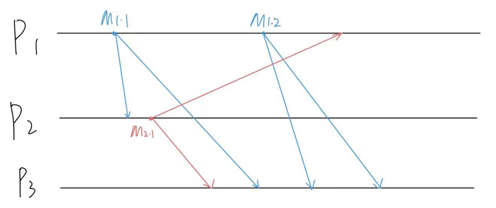

# HW2

## Q1:

A system with FIFO communication channels. Explain which of the ordering properties will be satisfied int the following four scenarios.

a: B-Multicast, there are no process failures;

FIFO satisfy! If there are no process failures, the B-Multicast will Unicast the message one by one. So one process will manage the Multicast happen earlier. Thus, the Multicast ordering in one process is guaranteed. Thus, satisfy FIFO ordering.

Causal Ordering: Not satisfied. In the figure, M2.1 HB M1.1, but M2.3  received earlier in P3. Not satisfy.

Total Ordering: Not satisfied. In the figure, receiving ordering is different for every Process.

b: R-multicast where there are no failures. 

In the R-Multicast, when receiving a new message, every Process will initial a new Multicast.(If already received the message, do nothing.)

FIFO ordering satisfied. In one process, it will handle the earlier multicast. So the multicast start earlier than another multicast will be delivered earlier.

Causal ordering satisfied. If one multicast HB another. It means B-multicast reaches to the Process earlier another multicast. This process will do another multicast to deliver this message to all processes in the group. This new Multicast will earlier than the multicast happen.

Total ordering. R-Multicast don't have ability to guarantee all process receive message in the same order.


c: R-multicast where process failure may occur:

FIFO ordering satisfied: If transmission failure occurs the other process will initiate B-Multicast to send the message again. If process crashes, the message can't be received, thus having no impact on FIFO ordering.

Causal Ordering: Same reason as FIFIO ordering. If failure occurs or process dies, the causal ordering is still satisfied.

Total ordering: Not satisfied. The R-multicast don't have a leader to decide a overall ordering for every process in the group.


d:sequence number-based FIFO multicast 

The sequence number record the Multicast number of each process. 

FIFO ordering satisfied: When receiving the message and the sequence number, the process will compare the number of each process index. The message will be buffed until the number is the next one of the sending process, thus the FIFO ordering is guaranteed.

Causal Ordering: The sequence number will record the number of other process, and the receiver will buffered the message until all other HB multicast message are received. Thus the causal ordering is satisfied.

Total ordering： Sequence number don't guarantee the global ordering. The parallel multicast can be received in different ordering.

## Q2:

a: 

The order need to assure: A B C, D E F

To assure the FIFO multicast, P2, P4 need to buffer the B's message until the A message is received.

P3 need to buffer C's message until B's message is received. P1 need to buffer F's message until E's message is received.

B->P2  7

B->P4 7 

B->P4 7

F->P1 16

b: We want to assure a causal multicast delivery order. 

All delay in FIFO ordering is needed. B->P2  7 B->P4 7  B->P4 7  F->P1 16

A->D

Thus D to P2 need to be delayed to 7. D to P4 need to be delayed to 7.

C->F satisfied


c: ISIS total ordering had been used.

Priority is higher_Priority, Process_id.

|      | A       | B       | C       | D       | E       | F       |
| ---- | ------- | ------- | ------- | ------- | ------- | ------- |
| P1   | 1.1     | 2.1     | 4.1     | ==6.1== | ==8.1== | 7.1     |
| P2   | 3.2     | 1.2     | 4.2     | 2.2     | 6.2     | 7.2     |
| P3   | 1.3     | ==6.3== | ==5.3== | 2.3     | 4.3     | 6.3     |
| P4   | ==3.4== | 1.4     | 4.4     | 2.4     | 6.4     | ==7.4== |

## Q3

An Multicast algorithm running in group of 100 nodes.

a: 

Every node when first receive a message, it will Multicast the message to every node include itself. 

So there will be 100*100 message sending.

b: 

Only send to higher-numbered processed.  Every node will send the message to the higher index node.

(99+98+97+96+......1+0) = (99)*100/2 = 4950

c: 

```python
# only re_multicast to the higher id process
def r_multicast(message,group):
    group.sort()
    for member in group:
        unicast(member, message)
def receive_message_message(message, group, sender):
    if message not in received_set:
        received_set.add(message)
        	if(sender.id != myid):
                for member in group:
                    if member.id > myid:
                        unicast(member, message)
            deliver(message)
```


## Q4

a: 

By central server algorthm.

|      | enter       | release        |
| ---- | ----------- | -------------- |
| P3   | 10+8+8 = 26 | 26+20+8 = 54   |
| P2   | 54+8 = 62   | 62+10+8 = 80   |
| P1   | 80+15 = 95  | 95+15 = 110    |
| P4   | 110+8 = 118 | 118+30+8 = 156 |
| P5   | 156+8 = 164 | 164+25+8 = 197 |

b:

In a token ring P1->P4->P2->P3->P5->P1

|      | enter       | release      |
| ---- | ----------- | ------------ |
| P3   | 26+8 = 34   | 34+20 = 54   |
| P2   | 16          | 16+10 = 26   |
| P1   | 87+8 = 95   | 95+15 = 110  |
| P4   | 110+8 = 118 | 118+30 = 148 |
| P5   | 54+8 = 62   | 62+25 = 87   |

c:  

Use Ricart-Agrawala mutual exclusion.

|      | enter         | release                 |
| ---- | ------------- | ----------------------- |
| P3   | 10+8+8 = 26   | 26+20 = 46 send to P2   |
| P2   | 46+8 = 54     | 54 + 10 = 64 send to P1 |
| P1   | 64+8 = 72     | 72+15 = 87 send to P4   |
| P4   | 87+8 = 95     | 95+30 = 125 send to P5  |
| p5   | 125 + 8 = 133 | 133+25 = 158            |


