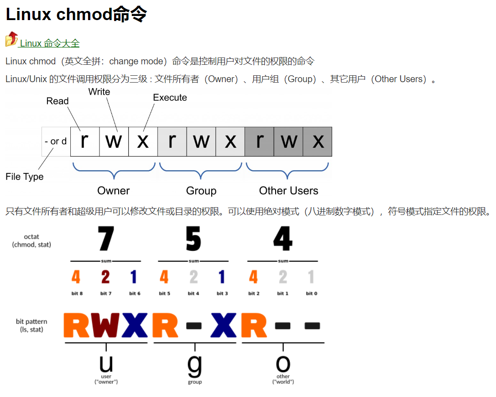

# 这个文件记录一些Linux使用的记录

## cd

cd ~回到当前用户的目录

cd /回到根目录

## ls

ls -l

可以看到程序的读写可执行属性。

ls -a

可以看到隐藏文件

## chmod

改变文件模式

使用ls -l可以看到文件的读写和时候可执行的属性，使用chmod可以进行改变。

**文件的权限描述：**

RWX：读,写,执行 

**分别显示：** 

文件类型 -：一般文件 d：目录

三块区域： 所有者，同组的用户， 别的用户



```c++
chmod 777 filename //可以将文件变为所有人可读可写
```


