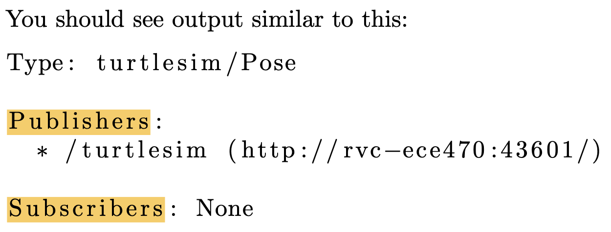
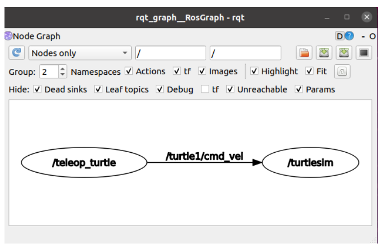

# 这个文档记录一下ROS的学习：

## ROS中的类型：

**Node：**

Node指的是ROS中的运行文件。

```shell
$ rosnode list #看到正在运行的Node
$ /rosout #这个是一个特殊的Node，是自动被roscore运行的，类似于std::cout。
$ rosrun package_name executable_name #使用rosrun运行方法

#查看node和topics
$ rosnode info node_name#可以看到一些Topics，并且可以看到哪些Node是Publisher或者Subscriber
$ rqt_graph#可以看到Node和Topics的图形关系表示
```

**Topics：**

Topics是Node之间信息交互的抽象。在信息交互中，发送信息的Node称为Publisher，接受信息的Node称为Subscriber。（Publisher和Subscriber之间互不干涉）

```shell
$ rostopic list	#显示出活跃的Topic信息。
```

可以通过下面的命令看到Publish到Topic上的信息。

```shell
$ rostopic echo /turtle1/pose#类似于printf可以看到这个Topic的实时更新
```

可以通过下面命令看到Topic的信息：

```shell
$ rostopic info /turtle1/pose#显示/turtle1/pose的信息
```



最重要的是第一行： **Type**表示出这个Topic的**message type**（每一个Topic对应一种messge type，会一直接受这种类型的message）

**Message：**

Message是Node之间发送的信息，上传到Topics，Node通过Subscribe Topics来获取Message。

```shell
$ rosmsg show message−type−name #通过这条命令看到message 结构体中的数据类型
$ rosmsg show turtlesim/Pose
```

```text
The output is:
float32 x
float32 y
float32 theta
float32 linear velocity float32 angular velocity
```

打印出来message structure的数据结构

我们可以publish Message到Topic通过command line。我们使用`rostopic pub` commend

```shell
$ rostopic pub topic_name message_name
$ rostopic pub /turtle1/cmd_vel geometry_msgs/Twist
```



这张照片就是第一个控制乌龟的概念图：

两个Nodes。teleop_turtle收到stdin的键盘cmd信息。publish收到的信息，将message发送给topic /turtle1/cmd_vel。第二个node /turtlesim subscribe这个topic，获取cmd的信息的更新，操纵乌龟运动。

**Start ROS:**

```shell
$ roscore #启动ROS
# 使用roslaunch可以自动启动ROS
$ roslaunch <package name> <launch file name>.launch # the launch file for all our labs:
$ roslaunch ur robot driver ur3e bringup . launch
```


