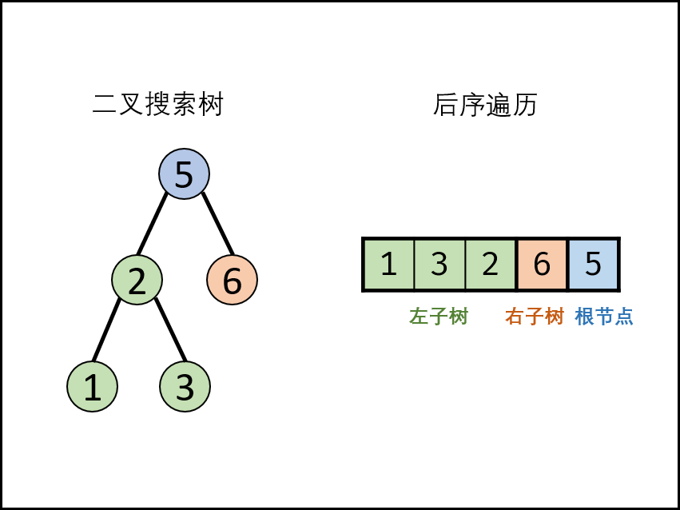

# 这个文档是对于Pb做的Leetcode 题目的记录:happy:

>  **目前使用的语言是**C++

[toc]


#  template

## 题目类型

### 题号:日期:

> ***网址：***
>
> **难度：**
>
> **思想概括：**
>
> **数据结构和算法：**

#### ==代码实现== :happy:

```c++
int main(){
  return 0;
}
```

#### 知识点整理:up:

* ....
* ....

#### 难点回顾:sagittarius:

```text


```


# 开始： :happy:

___

___


## 优先队列：

### 题号: 1792 最大平均通过率 优先队列（2023/2/21）

> ***网址： “[1792. 最大平均通过率 - 力扣（LeetCode）](https://leetcode.cn/problems/maximum-average-pass-ratio/)***
>
> **难度：中等**
>
> 思想概括：我想到了将学生一个个放进班级里，没有想到使用大根堆来减小寻找最大值。
>
> 数据结构和算法：最大堆（优先队列）。

#### ==代码实现== :happy:

```c++
class Solution {
public:
struct banji{
    double addition;
    double rate;
    double pass;
    int all_student;
    banji(int pass,int all_student){
        this->pass = (double)pass;
        this->all_student = all_student;
        this->rate = (double)pass/all_student;//两个int做除法可以将被除数转换为double，就能得到double的结果
        this->addition = ((double)pass+1.0)/(all_student+1.0) -rate;
    }
    friend bool operator<(banji A, banji B){ //作为函数内部的重载函数，this指针会作为parameter进入来索引当前实例
            return A.addition < B.addition;//写friend和不写friend的区别是什么？？？
        }//大顶堆要重载小于号 但是为什么？？
    /*
    bool operator<(const banji &B){ //不知道为什么这样写不行？？？
            return this->addition < B.addition;
        }*/
};
    priority_queue<banji> que;//如果要是写小顶堆怎么写？？？
    //priority_queue<banji, vector<banji>, greater<banji>> que;//最后这个greater<banji>是这样写吗？？
    double maxAverageRatio(vector<vector<int>>& classes, int extraStudents) {  
    int m = classes.size();
    for(int i=0;i<m;i++){
        banji current(classes[i][0],classes[i][1]); 
        //cout<< current.addition <<endl;
        que.push(current);
    }
    for(int i=0;i<extraStudents;i++){
        banji max_one = que.top();//使用priority_queue来提高找到最优值的速度
        //cout<< max_one.rate <<endl;
        que.pop();
        banji new_current(max_one.pass+1.0,max_one.all_student+1.0); 
        que.push(new_current);
    }
    double result = 0.0;
    while(!que.empty()){
        result+=que.top().rate;
        que.pop();
    }
    return result/m;
}
};
```

```c++
priority_queue<int> q;//默认是从大到小

priority_queue<int, vector<int> ,less<int> >q;//从大到小排序 

priority_queue<int, vector<int>, greater<int> >q;//从小到大排序
```


#### 知识点整理:up:

* 大根堆（当要找到多个元素的最大或者最小值的时候，使用大根堆能减少排序或者对比的时间）
* 结构体作为元素放入大根堆的自定义比较函数
* 结构体内部函数重载（重载<,>来作为大根堆排序的要求）
* this指针使用（作为非静态函数的形式参数，静态函数不需要this指针）

#### 难点回顾:sagittarius:

```text
这题主要是写有点难写。要记住使用最大堆！！不要傻傻的循环一个个比。

```


### 题号:面试题45 把数组组成最小的数 日期:2023/3/11

> ***网址：[面试题45. 把数组排成最小的数 - 力扣（LeetCode）](https://leetcode.cn/problems/ba-shu-zu-pai-cheng-zui-xiao-de-shu-lcof/?envType=study-plan&id=lcof&plan=lcof&plan_progress=jnl46lm)***
>
> **难度：**中等
>
> **思想概括：**使用优先队列使很容易想到的，但是这个函数的比较函数我没有想到，甚至想的时候我还觉得要不不用优先队列了。使用两个string合起来再比较的方法确实之前没遇到过，很有意思，记录一下。
>
> **数据结构和算法：**优先队列，函数对象（cmp函数）

#### ==代码实现== :happy:

```c++
class Solution {
public:
    struct cmp{
        bool operator()(string a, string b){
            return a+b > b+a; //这个cmp函数的想法很great！ 
        }
    };    
    priority_queue<string,vector<string>,cmp> heap;
    string minNumber(vector<int>& nums) {
        int l = nums.size();
        string result;
        for(int i=0;i<l;i++){
            int current = nums[i];
            string current_str = to_string(current);
            heap.push(current_str);
        }
        for(int i=0;i<l;i++){
            string current_str = heap.top();
            result+=current_str;
            heap.pop();
        }
        return result;
    }
};
```

#### 知识点整理:up:

* 这个题目的难点就是想出来比较函数怎么比。想出来之后就是很简单的思路，将int通过to_string转化为string，再放入优先队列中。然后一个个pop出来拼接成数字。

#### 难点回顾:sagittarius:

```text
这道题目唯一的难点就是想到比较函数应该怎么比较，别的没什么难的。
```


### 题号: 剑指Offer 54， 二叉搜索树的第k大节点 日期:2023/3/1

> ***网址：***[剑指 Offer 54. 二叉搜索树的第k大节点 - 力扣（LeetCode）](https://leetcode.cn/problems/er-cha-sou-suo-shu-de-di-kda-jie-dian-lcof/)
>
> **难度：**简单
>
> **思想概括：**使用优先队列进行第k大的数值分析（之前有做过类似的）。需要注意的是，如果再定义优先队列的时候加上greater<int>或者less<int>，需要在前面
>
> **数据结构和算法：**优先队列（谔谔，整理的时候发现，因为是二叉搜索树，右侧的值一定比左侧大，所以其实根本不需要优先队列，直接使用右根左的遍历方法，遍历到第k个节点直接return该数值就可以了）

#### ==代码实现== :happy:

```c++
/**
 * Definition for a binary tree node.
 * struct TreeNode {
 *     int val;
 *     TreeNode *left;
 *     TreeNode *right;
 *     TreeNode(int x) : val(x), left(NULL), right(NULL) {}
 * };
 */
class Solution {
public:
    priority_queue<int, vector<int>,greater<int>> mini_heap;//greater指的是升序排序，最先出来的是最小值！！
    //优先队列中的vector<int>定义中的int可以换成自定义的类。
    void dfs(TreeNode* root,int k){
        if(root->right) dfs(root->right,k);
        if(mini_heap.size()<k){
            //cout<< "insert"<<root->val <<endl;
            mini_heap.push(root->val);
        }
        else{
            return;//因为是二叉搜索树，本身是有序的，所以采用向右侧遍历，填满que之后就直接return，不用再遍历剩余的
            //这道题其实可以直接使用vector，装满k个 直接return随后一个值就行了。
            //if(root->val > mini_heap.top()){
            //cout<< "pop"<<mini_heap.top()<< "insert"<<root->val<<endl;
            //mini_heap.pop();
            //mini_heap.push(root->val);
        }
        }
        if(root->left) dfs(root->left,k);
    }
    int kthLargest(TreeNode* root, int k) {
    //使用最小堆 当size小于k的时候，往里面加元素。当size等于k之后，如果当前元素比最小值大，就往里面push 再pop
        if(!root) return 0;
        dfs(root,k);
        return mini_heap.top();
    }
};
```

#### 知识点整理:up:

* 要理解优先队列中的比较函数的含义。greater指的是升序排序，所以先出来的是最小值，是小顶堆。
* 使用小顶堆来记住大的值的信息，这种题遇到过一次，这道题加入了树的遍历，我选择了向右侧遍历。
* 对于优先队列定义时的greater理解：升序排列，小的先出来，所以是小顶堆

```c++
priority_queue<class,vector<class>,greater<class>> q_mini;//小顶堆
priority_queue<class,vector<class>,less<class>> q_max;//大顶堆
```


#### 难点回顾:sagittarius:

```text
这道题如果不是二叉搜索树，是无序的时候，需要使用优先队列进行复杂度减少。但是由于是二叉搜索树，其实根本不需要优先队列就可以简单
找到答案。
```

### 题号:剑指Offer 41 数据流中的中位数 日期: 2023/3/11

> ***网址：[剑指 Offer 41. 数据流中的中位数 - 力扣（LeetCode）](https://leetcode.cn/problems/shu-ju-liu-zhong-de-zhong-wei-shu-lcof/?envType=study-plan&id=lcof&plan=lcof&plan_progress=jnl46lm)***
>
> **难度：**困难
>
> **思想概括：**这道题目使用了方法很巧妙，第一次做的时候完全没有想出来，通过两个优先队列来求中位数的方法还是很新颖的。但是看了一眼解答，知道了使用两个优先队列之后，就自己做出来了，还是很不错滴。
>
> **数据结构和算法：**优先队列可以画一下两个优先队列的大小关系，上面的使小顶堆，下面的是大顶堆（top看到的都是最中间的数值）。

#### ==代码实现== :happy:

```c++
class MedianFinder {
public:
    /** initialize your data structure here. */
    int n=0;//数字的个数
    priority_queue<int, vector<int>, less<int>> big_heap;
    priority_queue<int, vector<int>, greater<int>> small_heap;
    MedianFinder() {
    }
    void addNum(int num) {
        n++;
        if(n==1){
            //cout<< "small_heap push"<<num<<endl;
            small_heap.push(num);
            return;
        } 
        //有元素了
        if(num>small_heap.top()){
            small_heap.push(num);
            //cout<< "small_heap push"<<num<<endl;
            while( (n%2==0 && small_heap.size()>n/2)||(n%2 ==1 && small_heap.size()>(n/2+1))){
                //数量超过一半了
                //cout<< "big_heap push"<<small_heap.top()<<endl;
                big_heap.push(small_heap.top());
                small_heap.pop(); 
            }
        }
        else{
            big_heap.push(num);
            //cout<< "big_heap push"<<num<<endl;
            while( (n%2==0 && big_heap.size()>n/2)||(n%2 ==1 && big_heap.size()>(n/2+1))){
                //数量超过一半了
                //cout<< "small_heap push"<<big_heap.top()<<endl;
                small_heap.push(big_heap.top());
                big_heap.pop(); 
            }
        }
    }
    
    double findMedian() {
        if(n%2 ==1){//是奇数
            if(big_heap.empty()) return small_heap.top();
            if(small_heap.size()>big_heap.size()){
                //cout<<"从小堆出" << small_heap.top()<<endl;
                return small_heap.top();
            }
            else{
                //cout<<"从大堆出" << big_heap.top()<<endl;
                return big_heap.top();
            }
        }
        else{
            double result;
            //cout<<"从两个堆出" << small_heap.top() << big_heap.top()<<endl;
            result = small_heap.top() + big_heap.top();
            result = result/2;
            return result;
        }
    }
};

/**
 * Your MedianFinder object will be instantiated and called as such:
 * MedianFinder* obj = new MedianFinder();
 * obj->addNum(num);
 * double param_2 = obj->findMedian();
 */
```

#### 知识点整理:up:

* 使用两个优先队列，通过判断两个堆的元素个数，并将元素个数均等的过程还是值得思考的。类似是树的平衡过程（但是简单不少哈哈）。

#### 难点回顾:sagittarius:

```text
主要是想法，可以使用两个优先队列来找到一组数据中间大小的元素。
```


_____

## 动态规划

### 题号:  剑指Offer 47 礼物的最大价值 DP（2023/2/21）

> ***网址： [剑指 Offer 47. 礼物的最大价值 - 力扣（LeetCode）](https://leetcode.cn/problems/li-wu-de-zui-da-jie-zhi-lcof/?envType=study-plan&id=lcof&plan=lcof&plan_progress=jnl46lm)***
>
> **难度：** 中等
>
> 思想概括：我写的dfs，能完成任务，但是算的太慢了，超出时间了。官方的方法通过循环，直接找到了推广的巧妙方法。我感觉比较难想。记录一下，代码的写法上没有什么难点，就是有点难想。
>
> 数据结构和算法：DP动态规划（不是递归中的DP）。

#### ==代码实现== :happy:

```c++
class Solution {
public:
/*
	//这是我一开始写的dfs递归找，画出递归的路线会发现没有利用好两边算的快，从两边扩散到中间的性质。
    int m;
    int n;
    unordered_map<int,int> DP;
    void dfs(vector<vector<int>>& grid, int x, int y,  int pre_num){
        if(x<0 || x>=m||y<0||y>=n) return;
        if(DP.count(x*y)){
            DP[x*n+y] = max(DP[x*n+y],pre_num + grid[x][y]);
        }
        else{
            DP[x*n+y] = pre_num + grid[x][y];
        }
        dfs(grid,x,y+1, DP[x*n+y]);
        dfs(grid,x+1,y, DP[x*n+y]);
    }
    int maxValue(vector<vector<int>>& grid) {
        m = grid.size();
        n = grid[].size();
        if(n ==1 && m==1){
            return grid[0][0];
        }
        int result;
        DP[0] = grid[0][0];
        dfs(grid,0,1,DP[0]);//往右找
        dfs(grid,1,0,DP[0]);//往下找
        return DP[(m-1)*n+(n-1)];
    }*/
    int maxValue(vector<vector<int>>& grid) {
        int m = grid.size();
        int n = grid[0].size();
        for(int i=0;i<m;i++){
            for(int j=0;j<n;j++){//这个是从左边一列一列往右边扩散。
                if(i==0&&j==0) continue;
                if(i == 0){
                    grid[i][j] = grid[i][j]+grid[i][j-1];//左边和上面的最大值
                }
                else if(j == 0){
                    grid[i][j] = grid[i][j]+grid[i-1][j];//左边和上面的最大值
                }
                else{
                    grid[i][j] = grid[i][j]+max(grid[i][j-1],grid[i-1][j]);//左边和上面的最大值
                }
            }   
        }
        return grid[m-1][n-1];
    }
};
```

#### 知识点整理:up:

* 这道题是DP的题目，中等题。但是我感觉算法还是有一点难想的。因为我直觉上就想到了dfs，根本没有往迭代的方向考虑。
* 每一个点只能向右走或者向左走。他思考的角度是一个到达的点，只能是通过左侧往右，或者上侧往下到达的，这样就可以通过比较算出。
* 同时，直接修改原本矩阵，减少了额外空间的使用。

#### 难点回顾:sagittarius:

```text
想法蛮难的。需要经验。。
```

### 题号: 剑指Offer46 把数字翻译成字符（2023/2/23）

> ***网址：***[剑指 Offer 46. 把数字翻译成字符串 - 力扣（LeetCode）](https://leetcode.cn/problems/ba-shu-zi-fan-yi-cheng-zi-fu-chuan-lcof/)
>
> **思想概括：**这道题不是很难。是比较典型的后项与前向有关的做法。根据前项得到的数据来计算后项，算是DP算法的使用。
>
> **数据结构和算法：**这道题使用了一个以前没有用过的函数：to_string（用于将数字转化成string），使用的目的数字很难得到最高位的数字，但是string可以轻松得到每一位的数字，所以将int转化为string。为了将得到的char转化成数字，建立了map进行对应。别的方面就是后向与前向的关系。总体来说是不难的一道中等题。

#### ==代码实现== :happy:

```c++
class Solution {
public:
    char word[11] = "0123456789";
    unordered_map<char ,int> char_map;
    int translateNum(int num) {
        string s = to_string(num);
        int length = s.length();
        if(length==1) return 1;
        for(int i = 0;i<10;i++){
            char_map[word[i]] = i;
        }
        int matrix[length];//建一个矩阵，矩阵的大小是总共的位数
        matrix[0] = 1;
        if((char_map[s[0]]*10+char_map[s[1]])<=25 && (char_map[s[0]]*10+char_map[s[1]])>=10){
            matrix[1] = 2;
        }
        else{
            matrix[1] = 1;
        }
        for(int i = 2;i<length;i++){
            if((char_map[s[i-1]]*10+char_map[s[i]])<=25 && (char_map[s[i-1]]*10+char_map[s[i]])>=10){
                matrix[i] = matrix[i-1]+matrix[i-2];
            }
            else{
                matrix[i] = matrix[i-1];
            }
        }
        return matrix[length-1];
    }
};
```

#### 知识点整理:up:

* 使用to_string将int转化为string，这样能得到数字的最高位
* 使用DP，利用matrix记录之前的结果，属于是DP在迭代中的应用，和之前做的从剑指Offer第47题有点相似。

#### 难点回顾:sagittarius:

```text
使用to_string将int转化为string
使用DP，迭代。
```


### 题号: 剑指Offer 42. 连续子数组的最大和 日期: 之前做的 2023/3/14整理

> ***网址：[剑指 Offer 42. 连续子数组的最大和 - 力扣（LeetCode）](https://leetcode.cn/problems/lian-xu-zi-shu-zu-de-zui-da-he-lcof/)***
>
> **难度：**简单
>
> **思想概括：**使用DP。我在整理一道前缀和的题目，在题库里面搜索前缀和，看到了这道题。我还记得这道题是在打LOL的选英雄的时候几分钟做完的，今天看到竟然没什么思路，于是整理一下。
>
> **数据结构和算法：**DP

#### ==代码实现== :happy:

```c++
int main(){
  return 0;
}
```

#### 知识点整理:up:

* ....
* ....

#### 难点回顾:sagittarius:

```text

```


___


## 单调栈

### 题号: 739 每日温度（2023/2/21）

> ***网址： [1792. 最大平均通过率 - 力扣（LeetCode）](https://leetcode.cn/problems/maximum-average-pass-ratio/)***
>
> **难度**： 中等
>
> **思想概括：**使用单调栈，来找到每一个元素后面最近的大于或小于的元素。
>
> **数据结构和算法:**这个单调栈的问题比较直白，之前还做过一道很抽象的单独栈。单调栈画一画就出来了。以找后面更大的元素为例：如果后面的元素比当前栈顶的元素要小，就压入栈。要是比当前的元素要大，就对栈中的元素出栈。

#### ==代码实现== :happy:

```c++
class Solution {   
public:
    vector<int> dailyTemperatures(vector<int>& temperatures){
        int m = temperatures.size();
        stack<pair<int,int>> monotonic_stack;
        vector<int> result(m);
        if(m ==0) return result;
        for(int i=0;i<m;i++){
            pair<int,int> current(temperatures[i],i);
            if(monotonic_stack.empty()){
                monotonic_stack.push(current);
                continue;
            }
            else if(current.first < monotonic_stack.top().first){
                //不能把之前的pop出来
                monotonic_stack.push(current);
                continue;
            }
            else{
                while((!monotonic_stack.empty())&&current.first > monotonic_stack.top().first){
                    result[monotonic_stack.top().second] = i - monotonic_stack.top().second;
                    monotonic_stack.pop();
                }
                //现在要么empty()要么比他大
                monotonic_stack.push(current);
            }
        }
        if(!monotonic_stack.empty()){
            for(int i=0;i<monotonic_stack.size();i++){
                result[monotonic_stack.top().second] = 0;
                monotonic_stack.pop();
            }
        }
        return result;
    }
};
```

#### 知识点整理:up:

* 单调栈的题目。这道题不难，第一次也做出来了（之前有接触了解到单调栈）。但是没有记录过就纪录一下关于单调栈的题目。


#### 难点回顾:sagittarius:

```text
画图，利用栈的记忆性来找到每一个元素后面的更大或者更小的元素。
```

## 双指针

### 题号: 剑指Offer 48. 最长不含重复字符得子字符串（2023/2/23）

> ***网址：***[剑指 Offer 48. 最长不含重复字符的子字符串 - 力扣（LeetCode）](https://leetcode.cn/problems/zui-chang-bu-han-zhong-fu-zi-fu-de-zi-zi-fu-chuan-lcof/)
>
> **难度：**中等
>
> **思想概括：**这道题目，我之前做过，所以这一次使用两个方法来完成。分别是硬做和巧做。题目还是蛮有意思的，尤其是使用第二种做法，用右侧进来的字母，如果有相同的字母就将左侧字母进行移动，这个想法十分巧妙。
>
> **数据结构和算法：** 左右指针，优先队列（其实可以不用优先队列）

#### ==代码实现== :happy:

```c++
class Solution {
public:
    int lengthOfLongestSubstring(string s) {
        /*用蠢的方法做一下
        int length =s.length();
        if(length ==1)return 1;
        int result = 0;
        for(int i=0;i<length;i++){
            char current = s[i];
            unordered_set<char> word_count;
            int number =0;
            for(int j =i;j<length;j++){
                if(!word_count.count(s[j])){
                    word_count.insert(s[j]);
                    number++;
                    result = max(result,number);
                    continue;
                }
                else{
                    //result = max(result,number);
                    break;
                }
            }
        }
        return result;
        //没想到硬写竟然过了....
        */
        //尝试用好一点的写法,这种想法蛮有意思的，右边来一个加一个。
        int left =0;
        int right = 0;
        int length = s.length();
        if(length ==1)return 1;
        unordered_set<char> word_count;
        priority_queue<int> que;
        int result = 0;
        while(left<length && right<length && left<=right){
            //cout<< left<< ' '<<right <<endl;
            if(word_count.count(s[right])){//找到重复的了
                que.push(result);
                while(word_count.count(s[right])){
                    word_count.erase(s[left]);
                    result--;
                    left++;
                }
                word_count.insert(s[right]);
            }
            else{//没有重复
                word_count.insert(s[right]);
            }
            right++;
            result++;
        }
        que.push(result);
        return que.top();   
    }
};
```

#### 知识点整理:up:

* 第二种写法，利用了重做往右查找的单调性，可以直接将左侧的字母去掉来使右侧字符进入，这样始终保证了子字符串是最大的长度。

#### 难点回顾:sagittarius:

```text
第一种想法很简单，但是用时很长，第二种方法较为难想，但写起来更容易。
```

### 题号: 剑指 Offer 21 调整数组顺序使奇数位于偶数前面 日期:2023/2/27

> ***网址：***[剑指 Offer 21. 调整数组顺序使奇数位于偶数前面 - 力扣（LeetCode）](https://leetcode.cn/problems/diao-zheng-shu-zu-shun-xu-shi-qi-shu-wei-yu-ou-shu-qian-mian-lcof/)
>
> **难度：**简单
>
> **思想概括：** 题目很简单，但是我没有想到双指针的算法！！ 在这种前后满足一些关系的题目中，使用双指针可以达到O(n)的复杂度，不用新建新的数据结构进行实例的储存。
>
> **数据结构和算法：**双指针，链表。

#### ==代码实现== :happy:

```c++
class Solution {
public:
    vector<int> exchange(vector<int>& nums) {
        /*
        //这个是我自己想的方法，太傻逼了
        int l = nums.size();
        vector<int> result;
        vector<int> oushu;
        for(int i=0;i<l;i++){
            if(nums[i] % 2 ==1){
                result.push_back(nums[i]);
            }
            else{oushu.push_back(nums[i]);}
        }
        for(int i=0;i<oushu.size();i++){
            result.push_back(oushu[i]);
        }
        return result;
        */
        //好一点的方法是使用双指针，比较好！
        int left = 0;
        int right = nums.size()-1;//要注意！！是size-1不然后访问没有定义的空间。
        while(left<=right){
            if(nums[left]%2 == 0){
                //如果左边找到一个偶数寻找右侧下一个奇数
                while(nums[right]%2 == 0 && right>left){
                    right--;
                }
                if(left<right){
                    int temp = nums[right];
                    nums[right] = nums[left];
                    nums[left] = temp;
                }
                else{
                    return nums;
                }
            }
            else{
                left++;
            }
        }
        return nums;
    }
};
```

#### 知识点整理:up:

* 使用双指针算法来解决前后数据满足不同要求的题目，这样可以很快地达到O(n)的复杂度。

#### 难点回顾:sagittarius:

```text
题目一点也不难，就是要想到双指针算法，这样时间复杂度是O(n)，也没有使用额外的vector空间。
```


___

## 树

### 题号: 翻转二叉树（简单）(2023/2/24)

> ***网址：[226. 翻转二叉树 - 力扣（LeetCode）](https://leetcode.cn/problems/invert-binary-tree/)***
>
> **难度：** 简单
>
> **思想概括：**关于树的翻转。这道题蛮有意思的，感觉不难，我第一遍思路就对了，但是感觉有点绕。所以记录一下。而且是简单题，所以需要掌握。
>
> **数据结构和算法：**树，DFS.

#### ==代码实现== :happy:

```c++
/**
 * Definition for a binary tree node.
 * struct TreeNode {
 *     int val;
 *     TreeNode *left;
 *     TreeNode *right;
 *     TreeNode() : val(0), left(nullptr), right(nullptr) {}
 *     TreeNode(int x) : val(x), left(nullptr), right(nullptr) {}
 *     TreeNode(int x, TreeNode *left, TreeNode *right) : val(x), left(left), right(right) {}
 * };
 */
class Solution {
public:
    TreeNode* invertTree(TreeNode* root) {
        //进行二叉树的翻转
        if(!root) return root;
        TreeNode* temp = root->right;
        if(root->left){
            root->right = root->left;//记录当前的右子树，然后赋值，对左子树做递归
            invertTree(root->left);
        }
        else{
            root->right = nullptr;
        }
        if(temp){
            root->left = temp;
            invertTree(root->left);
        }
        else{
            root->left = nullptr;
        }
        return root;
    }
};
```

#### 知识点整理:up:

* 交换节点的时候要进行节点的备份，然后用备份的节点进行判断。
* 对于原函数进行递归，我用的比较少，我一般都再写一个dfs进行递归，也算是比较少见的情况。

#### 难点回顾:sagittarius:

```text
进行右侧节点的保存，在用保存的节点进行递归。要能够分析递归的时候节点的访问顺序。
```

### 题号: 二叉树的最近公共祖先 日期: 2023/3/14🎂🎂

> ***网址：***[剑指 Offer 68 - II. 二叉树的最近公共祖先 - 力扣（LeetCode）](https://leetcode.cn/problems/er-cha-shu-de-zui-jin-gong-gong-zu-xian-lcof/?envType=study-plan&id=lcof&plan=lcof&plan_progress=jnl46lm)
>
> **难度：**简单
>
> **思想概括：**关于树的遍历的题目，尤其是简单题我向来是解决的比较快的，但是这道题我确实想了一会儿去看答案了。最终的写法当时好像是急着从紫金港回家，现在看这道题还是蛮好的，整理一下。整理的时候感觉这到题目还是有点难度，还是值得在思考思考的，但明天早上还要上428，准备睡了捏。
>
> **数据结构和算法：**树的递归遍历。

#### ==代码实现== :happy:

```c++
/**
 * Definition for a binary tree node.
 * struct TreeNode {
 *     int val;
 *     TreeNode *left;
 *     TreeNode *right;
 *     TreeNode(int x) : val(x), left(NULL), right(NULL) {}
 * };
 */
class Solution {
public:
    //这题目要整理一下！！！ 剑指Offer 68！
    TreeNode* lowestCommonAncestor(TreeNode* root, TreeNode* p, TreeNode* q) {
        if(!root) return nullptr;//如果找到最后还没找到。return nullptr;
        if(root->val == p->val || root->val ==q->val){
            return root;//如果子节点是要找的数值 就return 根节点。
        }
        TreeNode* ptr1 = lowestCommonAncestor(root->left,p,q);
        TreeNode* ptr2 = lowestCommonAncestor(root->right,p,q);
        if(ptr1 && ptr2){
            //第一次找到两个指针 return自己（一直return这个值到最终return；）
            return root;
        }
        else{
            if(ptr1){//如果这个根节点只有一个指针，则还得往上找节点
                return ptr1;//return当前的找到要找值得jiedian
            }
            else if(ptr2){
                return ptr2;
            }
            else return nullptr;//没找到
        }
        
    }
};
```

#### 知识点整理:up:

* 关于递归函数的遍历和return回来之后得函数运行。这种一个函数return的我很少这样写，我一般都会分开写，分开写确实更容易看清。一个函数调用两次，要抓住返回来时的值的意义。
* 这道题目困难的地方在于返回值和函数递归之前和之后都有关系。确实需要思考一下。

#### 难点回顾:sagittarius:

```text
函数的递归和return value的思考。
```


### 题号:剑指Offer 07 重建二叉树  日期:2023/3/16

> ***网址：***[剑指 Offer 07. 重建二叉树 - 力扣（LeetCode）](https://leetcode.cn/problems/zhong-jian-er-cha-shu-lcof/)
>
> **难度：**中等
>
> **思想概括：**谔谔，这道题做了挺久的，算是对于前序遍历和中序遍历有了更深的理解吧。中序遍历的左侧和右侧分别就是root节点的左子树和右子树的所有元素。只有中序遍历只能知道左侧和右侧的节点有哪些和节点的个数，但不能确定节点的顺序（确定不了左右子树的根节点）。通过前序遍历，和中序遍历提供的根节点信息可以找到左右子树的根。就可以再通过递归来确定所有的左右连接。
>
> 前序遍历：
>
> * 提供了根节点的值。可以通过中序遍历提供的信息找到左右子树的前序遍历。
>
> 中序遍历：
>
> * 提供了左右子树的个数。
>
> **数据结构和算法：**树的遍历。

#### ==代码实现== :happy:

```c++
/**
 * Definition for a binary tree node.
 * struct TreeNode {
 *     int val;
 *     TreeNode *left;
 *     TreeNode *right;
 *     TreeNode(int x) : val(x), left(NULL), right(NULL) {}
 * };
 */
class Solution {
public:
    unordered_map<int, int> value_index;
    TreeNode* get_tree(const vector<int>& preorder, const vector<int>& inorder, int in_left, int in_right, int pre_left, int pre_right){
        TreeNode* root = new(TreeNode);//new括号里是数据类型，生成的是指向数据结构的指针，不用加*
        root->val = preorder[pre_left];
        //cout<<"in_left:"<< in_left <<" "<< preorder[in_left] <<endl;
        int inorder_index = value_index[root->val];
        int left_l = inorder_index - in_left;
        int right_l = in_right - inorder_index;
        //cout<< left_l <<" "<< right_l <<endl;
        if(left_l){
            //计算inorder和preorder中左右子树的左右index
            //inorder_left = inorder_index-left_l在root左边
            //inorder_right = inorder_index - 1
            //preorder_left = pre_left+1在root右边
            //preorder_right = pre_left+left_l
            root->left = get_tree(preorder, inorder, inorder_index-left_l, inorder_index-1,pre_left+1,pre_left+left_l);
        }
        if(right_l){
            root->right = get_tree(preorder, inorder, inorder_index+1, inorder_index+right_l,pre_left+left_l+1,pre_left+left_l+right_l);
        }
        return root;
    }
    TreeNode* buildTree(vector<int>& preorder, vector<int>& inorder) {
        //这道题一开始没有想到应该怎么做。preorder的第一个可以得到根。
        //通过preorder找到root的值。通过inorder找到root确定left和right的长度。
        if(!preorder.size())return nullptr;
        for(int i=0;i<inorder.size();i++){
            value_index[inorder[i]] = i;
        }
        TreeNode* result = get_tree(preorder, inorder, 0, inorder.size()-1,0,preorder.size()-1);
        return result;
    }
};
```

#### 知识点整理:up:

* 由于原函数的输入值不好修改就再写一个递归函数，定义需要的输入值，在原函数中调用。

* 我经常想使用void的递归函数，这样就不用处理返回值。这道题可以思考一下树递归中返回值的使用。

#### 难点回顾:sagittarius:

```text
树的递归。
前序遍历和中序遍历的信息使用。
```


### 题号: 剑指Offer 33 二叉树的后序遍历序列 日期:2023/3/20

> ***网址：***[剑指 Offer 33. 二叉搜索树的后序遍历序列 - 力扣（LeetCode）](https://leetcode.cn/problems/er-cha-sou-suo-shu-de-hou-xu-bian-li-xu-lie-lcof/)
>
> **难度：**中等
>
> **思想概括：** 这道题和上次的重建二叉树有一点像，上次是通过前序遍历和中序遍历来重建一棵二叉树。前序遍历时，第一个是根节点 ，后面是左子树和右子树；中序遍历时，前面时左子树信息，中间是根，然后是右子树信息。而后序遍历，最后是根节点信息，前面分别是左右子树信息。只需要找到从右往左第一个小于根节点的下标index，就找到了左子树。
>
> **数据结构和算法：** 树的遍历，我觉得更重要的是vector的访问，要对于overflow有预防性。写代码时对于变量的初值思考。



#### ==代码实现== :happy:

```c++
class Solution {
public:
    bool verifyPostorder(vector<int>& postorder) {
        return check_Postorder(postorder, 0, postorder.size()-1);
    }
    bool check_Postorder(vector<int>& postorder, int left_id,int right_id){
        //left_id是子vector的左边index， right_id是vector右边的id
        if(left_id >= right_id) return true;
        int root = postorder[right_id];
        int ptr = right_id-1;
        int left_ptr = left_id-1;//left_ptr的初值在最左侧的id再往左，因为如果不进入line16的if，就没有左子树
        //！！！对于vector下标寻址的时候一定要判断index是否合理！！！
        while(ptr>=left_id && postorder[ptr]>root){
            ptr--;
        }
        
        if(ptr>=left_id){
            left_ptr = ptr;
            //左侧的应该全部小于root
            while(ptr>=left_id){
                if(postorder[ptr]>root){
                    //cout<< "Fail when root is:"<< root <<" "<<postorder[ptr]<<"<"<<root <<endl;
                    return false;
                }
                ptr--;
            }
        //这个大的符合
        }
        //cout<< "root: "<<root;
        //cout<< "左子树："<<postorder[left_id] <<"-"<<postorder[left_ptr]<<endl;
        //cout<< "右子树:"<<postorder[left_ptr+1] <<"-"<<postorder[right_id-1]<<endl;
        if(!check_Postorder(postorder, left_id, left_ptr)) return false;
        if(!check_Postorder(postorder, left_ptr+1, right_id-1)) return false;
        return true;
    }
};
```

#### 知识点整理:up:

* 对于树的后序遍历的数值排列的理解。
* vector下标访问之前一定要判断下标是否越界！！！要有提前预判报错的意识！！！

#### 难点回顾:sagittarius:

```text
寻找左子树和右子树。二叉搜索树中左子树必须要全部小于根节点，右子树必须要全部大于根节点。以此来进行判断。
划分出左右子树，根据左右的index递归判断。
```


## 链表

### 题号:剑指Offer 25 合并两个排序的链表 日期:2023/2/26

> ***网址：***[剑指 Offer 25. 合并两个排序的链表 - 力扣（LeetCode）](https://leetcode.cn/problems/he-bing-liang-ge-pai-xu-de-lian-biao-lcof/?envType=study-plan&id=lcof&plan=lcof&plan_progress=jnl46lm)
>
> **难度：**简单
>
> **思想概括：**合并两个链表。使用新的head和tail进行链表元素的连接。题目不难，但是我这道题之前做过一遍，但是第二遍做还是有错误。（一开始定义new_ptr和new_tail的时候，我没有进行赋值，导致后面访问是否为null的时候出现问题，如果一开始希望null，就赋值为nullptr）
>
> **数据结构和算法：**链表，对于链表元素进行连接。

#### ==代码实现== :happy:

```c++
/**
 * Definition for singly-linked list.
 * struct ListNode {
 *     int val;
 *     ListNode *next;
 *     ListNode(int x) : val(x), next(NULL) {}
 * };
 */
class Solution {
public:
    ListNode* mergeTwoLists(ListNode* l1, ListNode* l2) {
        if(!l1){return l2;}
        if(!l2){return l1;}
        ListNode* new_head = nullptr;//这个地方需要设为nullptr，不然后面会报错。
        ListNode* new_tail = nullptr;
        while(l1 && l2){
            if(l1->val < l2->val){
                if(!new_head){
                    new_head = l1;
                    new_tail = l1;
                    l1 = l1->next;
                    continue;
                }
                new_tail->next = l1;
                new_tail = new_tail->next;
                l1 = l1->next;
            }
            else{
                if(!new_head){
                    new_head = l2;
                    new_tail = l2;
                    l2 = l2->next;
                    continue;
                }
                new_tail->next = l2;
                new_tail = new_tail->next;
                l2 = l2->next;
            }
        }
        if(!l1){new_tail->next = l2;}
        if(!l2){new_tail->next = l1;}
        return new_head;
    }
};
```

#### 知识点整理:up:

* 使用新的指针进行链表的连接，使用新的指针的时候要首先进行赋值，并且要判断指针是否为第一个。使用方法：使用head进行return，使用tail进行连接。
* 要进行while循环结束后的连接，不要忘记了。

#### 难点回顾:sagittarius:

```text
其实不难，但是要记得每次连接的时候，l1 = l1->next; new_tail = new_tail->next;
```


___

## 字符串

### 题链表号: 剑指 Offer 58 日期: 2023/2/27

> ***网址：***[剑指 Offer 58 - I. 翻转单词顺序 - 力扣（LeetCode）](https://leetcode.cn/problems/fan-zhuan-dan-ci-shun-xu-lcof/)
>
> **难度：**简单
>
> **思想概括：**关于字符串的操作，我很不熟练。可以说，我最不熟练的就是字符串的操作，字符串做的题目也不多。这道题记录一下，因为一开始做的时候我也觉得很烦，原因也是对于字符串不是很熟悉。做完其实感觉把字符串当作string来处理，熟记string里面的一些方法就可以处理好字符串。
>
> **数据结构和算法：**string：从string中使用[]取出来的是char（需要使用' '进行比较）。
>
> string中的方法：a.substr(第几位开始取，取几位); a.pop_back();将string的最后一位弹出（此题中用来取出随后的空格。）

#### ==代码实现== :happy:

```c++
class Solution {
public:
    string reverseWords(string s) {
    int l = s.length();
    string every_word = "";//一开始赋值为空
    stack<string> result_sta;
    for(int i=0;i<l;i++){
        if(s[i]!=' '){//取string中的某一个进行比较时，要使用单引号,数据类型是char！！！！
            every_word = every_word+s[i];//string中进行了运算符重载，可以直接在后面+!!
            continue;
        }
        else {//遇到' '
            if(every_word.length()>0){
                result_sta.push(every_word);//遇到空格进行分析的题目都可以这样做！！遇到空格截断！！
                every_word = "";
            }
        }
    }
    if(every_word.length()>0){
        result_sta.push(every_word);
    }
    l = result_sta.size();
    string result = "";
    for(int i =0;i<l;i++){
        result = result+result_sta.top()+' ';
        //cout<< result_sta.top()<<endl;
        result_sta.pop();
    }
    result.pop_back();//去掉最后的空格
    return result;
}
};
```

#### 知识点整理:up:

* 这是一类遇到空格截断的问题！遇到空格阶段都可以用这种方法进行分析。一位一位取。不是空格就在current_string后面加上当前的。遇到string就把current_string拿出来进行分析。

#### 难点回顾:sagittarius:

```text
对于string的分析不要怕。string就是char封装好的array，可以对于里面的char一位一位分析。这道题目也运用了stack，用于逆序的输出
方法使用：
s.substr(第几位开始取，取几位);
s.pop_back(去掉最后一位);
```

___


## DFS递归查找

### 题号:剑指 Offer 12 矩阵中的路径 日期:2023/2/28

> ***网址：***[剑指 Offer 12. 矩阵中的路径 - 力扣（LeetCode）](https://leetcode.cn/problems/ju-zhen-zhong-de-lu-jing-lcof/)
>
> **难度：**中等
>
> **思想概括：**这道题是使用DFS在二维矩阵中的查找。之前做过一遍，这次做在将二维矩阵打平成一维矩阵的时候出现了打错误，导致debug了很久之后要引以为戒！！！
>
> **数据结构和算法：**DFS，二维数组的打平，递归中的上下左右剪枝。

#### ==代码实现== :happy:

```c++
class Solution {
public:
    int x_matrix[4] = {-1,1,0,0};
    int y_matrix[4] = {0,0,1,-1};
    int l1;
    int l2;
    //bool matrix[6][6];
    //当然可以使用全局的二维数组，这样就不用计算打平成一位的位置，也不用传入数组指针。但是尽量不要将二维数组当作参数传入函数
    //因为二维数组是指针的指针**bool，且传入之后在函数中不能直接通过matrix[i][j]进行访问；
    bool dfs(vector<vector<char>>& board, string word,int i,int j,int index, bool* arrive){
        if(board[i][j] == word[index]){
            //从周围找可能的路径
            if(index == word.length()-1){
                return true;//找到最后一个
            }
            for(int k = 0;k<4;k++){//四个方向进行遍历
                int new_i = i+x_matrix[k];
                int new_j = j+y_matrix[k];
                if(new_i<0 || new_i>=l1 || new_j<0 || new_j>=l2){
                    continue;
                }
                else if(arrive[new_i*l2+new_j]){//如果这个点被标记了，就跳过
                    continue;
                }
                else{
                    if(board[new_i][new_j] == word[index+1]){
                        arrive[new_i*l2+new_j] = true;
                        if(dfs(board,word,new_i,new_j,index+1,arrive)){
                            return true;
                        }
                        arrive[new_i*l2+new_j] = false;
                    }
                    continue;
                }
            }
        }
        return false;
    }
    bool exist(vector<vector<char>>& board, string word) {
        l1 = board.size();
        l2 = board[0].size();
        bool arrive[l1*l2];//二维数组使用一维进行标记！！！ 我老是犯这种低级错误
        memset(arrive,0,sizeof(arrive));//set all locations to false
        for(int i=0;i<l1;i++){
            for(int j=0;j<l2;j++){
                char current = board[i][j];
                if(current == word[0]){
                    arrive[i*l2+j] = true;//！！！i要乘以j这一行的个数！！！相当于每过一行，要加j这一行的个数！！真的要注意
                    if(dfs(board,word,i,j,0,arrive)){
                        return true;
                    }
                    arrive[i*l2+j] = false;
                }
            }
        }
        return false;
    }
};
```

#### 知识点整理:up:

* 将二维数组打平成一维，这样可以将一维数组当作参数输入。(i,j)在一维中的位置:i*l2+j（l2是j的limit）
* 使用数组对于每一个位置进行是否到过的记录，来避免字母的重复使用。

#### 难点回顾:sagittarius:

```text
！！！二维数组的打平，真的是低级错误！！
使用打平的一维数组进行位置信息的记录。
使用dfs完成遍历，使用矩阵进行上下左右位置的遍历。使用||进行剪枝操作。
```

### 题号:剑指 Offer 面试题 13 机器人的运动范围 日期:2023/2/28

> ***网址：***[面试题13. 机器人的运动范围 - 力扣（LeetCode）](https://leetcode.cn/problems/ji-qi-ren-de-yun-dong-fan-wei-lcof/)
>
> **难度：**中等
>
> **思想概括：**使用递归和vector<vector<bool>>来进行遍历和记录。这道题不难，基本上想法很简单，比上面那一道题也要简单。但是在里面使用了vector的二维数组，我一般能用矩阵解决的时候都会选择用矩阵，但是使用矩阵作为函数参数太麻烦了，当要使用二维数组参数的时候可以使用vector<vector<bool>>可以很好地解决矩阵传参的困难。同时，这道题记录一下vector的大小和数值初始化。
>
> **数据结构和算法：**二维数组，dfs.

#### ==代码实现== :happy:

```c++
class Solution {
public:
    int result = 1;
    int x_move[4] = {1,-1,0,0};
    int y_move[4] = {0,0,1,-1};
    int l1;
    int l2;
    bool cout_sum(int i, int j,int k){
        //计算各个位之和，返回是否满足要求
        int result = 0;
        while(i){
            result += i%10;
            i = i/10;
        }
        while(j){
            result += j%10;
            j = j/10;
        }
        return result<=k;
    }
    void dfs(int i,int j, int k,vector<vector<bool>> &matrix){//！！使用引用，很重要！！！
        if(!cout_sum(i,j,k)) return;
        //这个点符合要求,对四周的点进行扩张
        for(int q=0;q<4;q++){
            int x_new = i+x_move[q];
            int y_new = j+y_move[q];
            if(x_new<0 || x_new>=l1 ||y_new<0||y_new>=l2) continue;
            else if(matrix[x_new][y_new])continue;
            else{
                if(cout_sum(x_new,y_new,k)){
                    //cout<< i<<" "<<j <<endl;
                    result++;
                    matrix[x_new][y_new] = true;
                    dfs(x_new,y_new,k,matrix);
                } 
            }
        }
    }
    int movingCount(int m, int n, int k) {
        l1 =m, l2= n;
        vector<vector<bool>> matrix(l1,vector<bool>(l2,0));
        //vector<int> v1(m, 0); 一维vector初始化大小和数值
        //vector<vector<int> > v2(m, vector<int>(n, 0));二维vector 初始化大小和数值

        //memset(matrix,false,sizeof(matrix));
        matrix[0][0] = true;
        dfs(0,0,k,matrix);
        return result;
    }
};
```

#### 知识点整理:up:

* 传参时，引用的使用！ 当一个数据不需要产生新的副本的时候，使用引用可以避免新的副本出现。尤其是数组，加入引用可以在递归的时候一直修改一个的是同一个数组，而不会拷贝出新的数组。
* 使用vector来生成二维数组进行传参。vector的初始化！！很重要！

```c++
vector<int> v1(m, 0); //一维vector初始化大小和数值。加括号，（大小，初始值）
vector<vector<int> > v2(m, vector<int>(n, 0));//二维vector 初始化大小和数值。加括号，先定义外层大小，再加括号。
//再定义内层vector。
```

#### 难点回顾:sagittarius:

```text
使用引用，来保证不产生副本。
使用vector<vector<bool>>来进行二维数组的传参。
要熟记vector的大小和数值的初始化。
```


## 前缀和

### 题号: 面试题17.05. 日期:2023/3/11（每日一题）

> ***网址：***[面试题 17.05. 字母与数字 - 力扣（LeetCode）](https://leetcode.cn/problems/find-longest-subarray-lcci/)
>
> **难度：**中等
>
> **思想概括：**这道题目使用前缀和的方法。很巧妙的想法。我做题的时候思考了很久，一直想的是使用双指针做的话会导致每一个做指针都要重新算一遍，而且右指针会没法往左移。这种题分成两类，使用前缀和的方法很巧妙，可以通过一次遍历获取需要的信息，通过减法得到两个节点之间的信息是否符合。而且使用map的方法将最先得到某个值的节点index存入map，这样就能从左向右一遍获得最长的信息！真的是很巧妙呀！
>
> **数据结构和算法：**前缀和，map。

#### ==代码实现== :happy:

```c++
class Solution {
public:
    //3/11/2023每日一题
    //这个题目使用前缀和，似乎没使用过的方法；
    vector<string> findLongestSubarray(vector<string>& array) {
        int l = array.size();
        int sum = 0;
        int result = 0;
        int first_index = -1;
        unordered_map<int,int> hash;//unordered_map<前缀和,index>
        hash[0] = -1;
        for(int i=0;i<l;i++){
            if(array[i][0]>='0' && array[i][0]<='9'){
                sum++;
            }
            else sum--;
            if(hash.count(sum)){
                int current_length = i-hash[sum];//右节点包括，左节点不包括。
                if(current_length>result){
                    result = current_length;
                    first_index = hash[sum]+1;
                }
            }
            else{//如果前缀和sum没有再map中，则使这个sum的第一次出现（最左节点），用map记录。
                hash[sum] = i;
            }
        }

        return vector<string>(array.begin() + first_index, array.begin() + first_index + result);

    }
};
```

#### 知识点整理:up:

* 使用前缀和做这个题目真的很巧妙，我整理的时候想起来之前是有使用过这种方法的。
* 这道题可以使用前缀和方法的特点是子序列，基本关于子序列的题目（要求序列中所有数字的和等于某个数或者求最大最小值，都可以使用前缀和）！数字的个数等于字母的个数，使用前缀和可以通过相减得到刚好为零的字符串长度（其实也可以得到字符转）。如果这个题目不是找零，其实题目会更简单，可以使用DP算法（[剑指 Offer 42. 连续子数组的最大和 - 力扣（LeetCode）](https://leetcode.cn/problems/lian-xu-zi-shu-zu-de-zui-da-he-lcof/)）。

#### 难点回顾:sagittarius:

```text
使用前缀和解决数组中子序列的问题！！真的感觉很好用。我看了连续子数组的最大和那道题，也是很明显的使用前缀
和可以完成的题目。
```


### 题号: 剑指Offer 42 最大的子数组的最大和  日期: 2023/3/14

> ***网址：[剑指 Offer 42. 连续子数组的最大和 - 力扣（LeetCode）](https://leetcode.cn/problems/lian-xu-zi-shu-zu-de-zui-da-he-lcof/)***
>
> **难度：**简单
>
> **思想概括：**这道题的DP做法在动态规划部分已经整理过了，这里由于今天看到了前缀和发现类似子数组这个类型的题目都可以用前缀和的方法解决。记录一下两种方法的解题。
>
> **数据结构和算法：**前缀和。

#### ==代码实现== :happy:

```c++
class Solution {
public:
    priority_queue<int> que;
    int maxSubArray(vector<int>& nums) {
        /*
        int length = nums.size();
        if(length == 1) return nums[0];
        //int matrix[length];
        //memset(matrix,0,sizeof(matrix));
        que.push(nums[length-1]);
        for(int i=length-2;i>=0;i--){
            nums[i] = max(nums[i], nums[i]+nums[i+1]);
            que.push(nums[i]);
        }
        return que.top();*/
        //这里尝试不使用DP使用前缀和的方法做一下
        int l = nums.size();
        int sum = 0;
        int min_num = 0;
        int result = -100;
        for(int i=0;i<l;i++){
            int current = nums[i];
            sum = sum + current;//当前的前缀和
            result= max(result,sum - min_num);//当前子序列的和减去记录下来的产生过的最小前缀和
            cout<< result <<endl;
            min_num = min(min_num,sum);//记录产生过的最小前缀和
        }
        //记录的目的是为了只遍历一遍就找到最大的子序列长度。
        return result;
    }
};
```

#### 知识点整理:up:

* 子数组的问题都可以尝试通过前缀和来解决，这样执行需要遍历一遍就可以找到答案！！
* ....

#### 难点回顾:sagittarius:

```text

```


___

## 位运算

### 题号: 剑指Offer 16 数值的整数次方 2023/3/20

> ***网址：[剑指 Offer 16. 数值的整数次方 - 力扣（LeetCode）](https://leetcode.cn/problems/shu-zhi-de-zheng-shu-ci-fang-lcof/)***
>
> **难度：**中等
>
> **思想概括：** 在C++中计算数值的阶乘。最简单的方法求n次方，当然是直接循环n次，但是这样的复杂度是O(n)。使用这道题目的方法：快速幂，可以将复杂度下降到*O*(*log*2*n*)。
>
> **数据结构和算法：**快速幂，补码，将int转化为long要构建新的函数，位右移除以二。
>
> 将次方数n分解为二进制，在底数上相当于逐渐平方，然后根据二进制为1还是0看要不要乘。


#### ==代码实现== :happy:

```c++
class Solution {
public:
    double myPow(double x, int n) {
        /*
        double result = 1;
        if(n>0){
            while(n>0){
                result = result*x;
                n--;
            }
        }
        else{
            double multi = 1/x;
            while(n<0){
                result = result*multi;
                n++;
            }
        }
        return result;
        //这是最simple的写法，但是时间复杂度是O(n)太慢了
        */
        //使用n二进制，看位是否为1，并且对于x进行平方 
        if(x == 1) return 1;
        long new_n = n;
        if(new_n<0){
        //将正数n和负数n都给转换为正数n
        //注意：代码中 int32 变量n∈[−2147483648,2147483647]
        //因此当 n = -2147483648 时执行 n = -n 会因越界而赋值出错 补码 负的多一个数字
        //我们此处一开始就把 n 用 long 存储
            x = 1/x;
            new_n = -new_n;
        }
        return cal_Pow(x,new_n);
    }
    //数据类型不要搞错了！！ 把n变成long就需要一个新的函数来接收long类型的变量。
    double cal_Pow(double x, long n){
        double result = 1;
        while(n){
            if(n&1){
                //最后一位是1
                result *=x;
            }
            //cout<< x <<endl;
            x = x*x;
            n = n>>1;//右移一位
            //cout<< n <<endl;
        }
        return result;
    }
};

```

#### 知识点整理:up:

* int是带符号的，uint是不带符号的。默认**int占用四个字节**，也就是32位。int32_t是32位的，第一位是符号位，int32 变量n∈[−2147483648,2147483647]。**unsigned_int**不需要符号位，和int所能够表示的数字个数是一样的：[0,4294967295]。
* char只占一个字节也就是8位。在ASCII中，定义的字符码值只有0-127。从本质来讲，字符'a','b'对应的就是二进制整数。刚刚查资料看到，char分为三种： char, signed_char, unsigned_char；
* 别的一下数据的占用空间大小：Long long: 8bits. double: 8bits. 
* 注意： 数值在做左移或者右移的时候要赋值。也就是`n = n<<1;`当然也可以写作`n <<=3;`反正别忘了赋值。


#### 关于左移右移的知识整理：

##### 左移：

把一个数的所有位都向左移动若干位。

当左移的位数超过该数值类型的最大位数时,编译器会用左移的位数去**模类型的最大位数**,然后按**余数**进行移位,如:

```c++
int i = 1 //设int占1个字节，即8位 i = 1：0000 0001
i = i << 9;
// 9 % 8 = 1 即此时左移1位 i = 2 ：0000 0010
int i = 64 //设int占1个字节，即8位 i = 1：0100 0000
i = i << 9;
// 9 % 8 = 1 即此时左移1位 i = 0 ：1000 0000 最高位被丢弃

```

**总结：左移的时候，丢弃高位，0补低位**

##### 右移：把一个数的所有位都向右移动若干位。

右移分为两种：有符号右移和无符号右移。

**有符号右移：**

符号是：>>

向右移动之后，左侧空缺部分：正数补0，负数补1；也就是算数右移。

**无符号右移：**

==符号是： >>>三个表示无符号右移==，也就是左边补充0

高位直接补0；


同样当移动的位数超过类型的长度时，会取余数，余数是几，移动几位；

这是因为**位移是一个取模**的过程
当我们右移4位：4 % 32 = 4
当我们右移32位：32 % 32 = 0 也就是不动
那么当右移33位，那不就是右移1位吗！

#### 难点回顾:sagittarius:

```text
对于幂运算降低运算的复杂度。使用位运算来确定二进制位，使用右移来逐位运算。
```


### 题号: 剑指Offer 65 不用加减乘除做加法 2023/3/21

> ***网址：***[剑指 Offer 65. 不用加减乘除做加法 - 力扣（LeetCode）](https://leetcode.cn/problems/bu-yong-jia-jian-cheng-chu-zuo-jia-fa-lcof/)
>
> **难度：**简单
>
> **思想概括：**使用位运算，做数值的加法。我做的方法和官方给出来的方法不一样。我使用的是逐位的加法，官方通过将进位和非进位分离进行计算。这道题涉及了算数右移的知识，复习了补码的知识。同时使用了异或的运算，还是涵盖了蛮多的知识点的，值得记录一下。做题的时候让人回想起2020年ECE120的时候，学习用门电路实现功能和画真值表。
>
> **数据结构和算法：**位运算，异或，右移，加法器的实现。

#### ==代码实现== :happy:

```c++
class Solution {
public:
    int add(int a, int b) {
        //不用加减乘除做运算，那就是做位运算来计算加法
        int result = 0;
        int carry = 0;//进位
        int bit = 0;//当前位1还是0，加不加
        long num = 1;
        int count = 0;//最多左移32次
        while((count<32) && (a | b | carry)){
            bit = (a&1)^(b&1)^carry;//三个异或可以直接连起来异或。
            carry = ((a&1)&(b&1)|((a&1)&carry)|((b&1)&carry));
            //cout<< bit << " "<< carry  <<endl;
            result+=bit*num;
            num = num*2;
            a>>=1;//算数左移，正数补0，负数补1；
            b>>=1;
            count++;//记录移动次数 最多移动32次
        }
        return result;
    }
};
```

#### 知识点整理:up:

* 位运算。
* 有符号右移对于正数左侧补充0，对于负数左侧补充1；（详情看上一道题中的左移右移整理）
* 左移的情况右侧永远补0；

#### 难点回顾:sagittarius:

```text
位运算，异或，加法器。
```

### 题号: 剑指Offer 56-1 数组中数字出现的次数 （2023/3/22）

> ***网址：***[剑指 Offer 56 - I. 数组中数字出现的次数 - 力扣（LeetCode）](https://leetcode.cn/problems/shu-zu-zhong-shu-zi-chu-xian-de-ci-shu-lcof/)
>
> **难度：**中等
>
> **思想概括：**这个题目的做法之前从来没有遇到过！总结来说是异或运算的实战使用！这个中等题是由一个简单题进化而来的：这里这一下这个简单题：

```text
简单题：给你一个非空整数数组 nums ，除了某个元素只出现一次以外，其余每个元素均出现两次。
找出那个只出现了一次的元素。
你必须设计并实现线性时间复杂度的算法来解决此问题，且该算法只使用常量额外空间。
```

```c++
class Solution {
public:
    int singleNumber(vector<int>& nums) {
        //除了某个元素只出现一次以外 别的元素都出现两次
        //使用异或运算来过滤掉出现两次的元素,并且异或运算有交换率,前后顺序是不影响的
        int result = 0;
        for(int i=0; i<nums.size();i++){
            result = result^nums[i];
        }
        return result;
    }
};
```

这个解法是使用了异或运算的特性！

**XOR的特性：**

* **一个值与自身的运算，总是为 false。** 

	`x^x =0`

* **一个值与0的运算，总是等于本身。**

​	`x^0 = x`

* **异或具有可交换性**

	`x^y = y^x`

* **结合性**

​	`x^(y^z) = (x^y)^z`

> **数据结构和算法：** 上面这道题目是只有一个数出现一次，别的都出现两次，所以使用XOR可以过滤掉出现两次的数字。

#### ==代码实现== :happy:

```c++
class Solution {
public:
    vector<int> singleNumbers(vector<int>& nums) {
        /*
        //这个是我愚蠢的排序,不符合要求的,因为排序本身就超过时间复杂度了.
        //O(1)的空间复杂度就是只能使用常数空间,只储存变量参数之类的
        sort(nums.begin(),nums.end());
        for(int i=0;i<nums.size();i++){
            int current = nums[i];
            if((i+1)<=(nums.size()-1) && nums[i] == nums[i+1]){
                nums.erase(nums.begin()+i);
                nums.erase(nums.begin()+i);
                i--;
            }
        }
        return nums;
        */
        //使用异或运算,来过滤掉重复的数据
        int xo_result = 0;//两个出现一次的数字的XOR结果
        for(int i=0;i<nums.size();i++){
            xo_result = xo_result^nums[i];
        }
        //找一位为1的 这一位 那两个数字的二进制位不一样
        int mask = 1;
        while(!(mask&xo_result)){
            mask = mask<<1;//将mask左移一位
        }//通过移动mask来寻找这个XOR结果的右侧第一个为1的位。
        //找到从右往左的第一位1
        int num1 = 0;
        int num2 = 0;
        for(int i=0;i<nums.size();i++){
            if(nums[i]&mask){
                num1 = num1^nums[i];
            }
            else{
                num2 = num2^nums[i];
            }
        }
        vector<int> result = {num1,num2};
        return result;
    }
};
```

#### 知识点整理:up:

* 使用异或来过滤重复的数字。（成对出现的数字，异或在一起为0）
* 通过左移mask来寻找一个数字为一的位。（也可以通过左移mask来找到所有为1的位）

#### 难点回顾:sagittarius:

```text
使用XOR来过滤掉成双出现的数字。在这道题中，只出现一次的数字只有两个，所以通过找一位他们XOR结果为一的位
来将数字分为两组，分别XOR找到两个数字。
下一题是重复数数字没有出现两遍的情况。
```


### 题号:剑指Offer 56 -2 数组中数字出现的个数 2 （2023/3/22）

> ***网址：***[剑指 Offer 56 - II. 数组中数字出现的次数 II - 力扣（LeetCode）](https://leetcode.cn/problems/shu-zu-zhong-shu-zi-chu-xian-de-ci-shu-ii-lcof/)
>
> **难度：**中等
>
> **思想概括：**这个题目数字出现了三次，那就不能直接使用异或来消除了，
>
> **数据结构和算法：**异或的使用，真值表求逻辑表达式。
>
> 

这个题目别的数字都出现三次。只有一个数字出现一次。所以别的数字的每一位要么有3个1，要么有三个0。三个0的情况不用考虑，三个1的情况就要将1求余数。为了能够记录实现每一位的数字到3返回0，使用为二进制位计算逻辑值：

00->01->10三个状态，根据进来的位是1或者0进行转化。


#### ==代码实现== :happy:

```c++
#define S2
#ifdef S1
/*  
            ab    ab    ab    ab
    状态机: 00 -> 01 -> 10 -> 00
    真值表:
    c   b   a   b'
    0   0   1   0
    0   0   0   0
    0   1   1   0
    0   1   0   1
    1   0   1   0
    1   0   0   1
    1   1   1   0
    1   1   0   0
    取结果为1的情况：b' = ~ab~c + ~a~bc = ~a(b~c+~bc) = ~a(b^c)
    因此，可以推出: b = b ^ c & ~a

    在更新b之后：
            ab    ab    ab    ab
    状态机: 01 -> 00 -> 10 -> 01
    调换ab: ba    ba    ba    ba
    状态机: 10 -> 00 -> 01 -> 10
    与上述一致，因此，可以推出：a = a ^ c & ~b

*/
class Solution {
public:
    int singleNumber(vector<int>& nums) {
        int a = 0, b = 0;
        for (int c: nums) {
            b = b ^ c & ~a;
            a = a ^ c & ~b;
        }
        return b;
    }
};
#else
/*
    用一个数组统计1的数目

*/
class Solution {
public:
    int singleNumber(vector<int>& nums) {
        vector<int> bits_num(32, 0);
        const int m = 3;
        for (int num: nums) {
            int index = 0;
            while (num > 1) {
                bits_num[index++] += num & 1;
                num = num/2;
            }
            bits_num[index] += num & 1;
        }
        int b = 0, res = 0;
        for (int bit: bits_num) {
            bit = bit % 3;
            res |= bit<<b;
            ++b;
        }
        return res;
    }
};
#endif
```

#### 知识点整理:up:

* 这道题我觉得太麻烦了，就没有自己实现，这个是复制的代码。
* 使用真值表 计算每一位的状态变化，这个方法倒是很新颖，也不容易想到。

#### 难点回顾:sagittarius:

```text
异或运算的使用。真值表。
```


## 数学

### 题号:剑指Offer 39. 数组出现次数超过一半的数字

> ***网址：***[剑指 Offer 39. 数组中出现次数超过一半的数字 - 力扣（LeetCode）](https://leetcode.cn/problems/shu-zu-zhong-chu-xian-ci-shu-chao-guo-yi-ban-de-shu-zi-lcof/)
>
> **难度：**简单
>
> **思想概括：**这道题有三种做法。1： 使用HashMap 2： sort看中间的数值 3： 摩尔投票算法
>
> 最值得记录的摩尔投票算法！真的很巧妙，而且很好理解，只需要遍历一遍就行！

**注意：**只有一个元素的个数超过总数的一半的时候才能用摩尔投票算法！ 也就说，摩尔投票算法是找到个数超过总数一半的数，而不是找众数！

> **数据结构和算法：** 摩尔投票算法

#### ==代码实现== :happy:

```c++
class Solution {
public:
    int majorityElement(vector<int>& nums) {
        //这道题目有三种做法 
        //1. Hashmap; 2. sort然后看中间的数值; 3. 最值得记录的是得三种方法摩尔投票算法
        //直接写摩尔投票法！
        int value = nums[0];
        int count = 1;
        for(int i=1 ;i < nums.size();i++){
            int current = nums[i];
            if(count){
                if(current == value){
                    count++;  
                }
                else{
                    count--;
                }
            }
            else{
                //count = 0
                //cout<<"value = "<< current<< endl;
                value = current;
                count = 1;
            }
        }
        return value;
        //hashmap不想写了，太简单了，写了就挂呵呵。
        /*
        //使用sort的方法！
        int l = nums.size();
        sort(nums.begin(),nums.end());
        return nums[l/2];
        */
    }
};
```

#### 知识点整理:up:

* 通过摩尔投票法，找个数超过总数一半的数！ 

	 **思想就是**： 出现一个不一样的就和前一个对掉，最后剩下的就是摩尔投票法找到的个数超过一半的数。（最差的情况，全是和这个数不一样的都和这个数对掉，最后找到的还是这个数：））

#### 难点回顾:sagittarius:

```text
这个算法没接触过啊！很好理解的算法，而且好用！嘻嘻🤭
```


## 其他

### 题号: （每日一题）1238：循环码排列

> ***网址：[1238. 循环码排列 - 力扣（LeetCode）](https://leetcode.cn/problems/circular-permutation-in-binary-representation/)***
>
> **难度：** 中等
>
> **思想概括：**我使用的是自己想出来的方法。采用的是DP的思想。我觉得这道题能做出来还是蛮牛的。但是官方给出的方法是使用二进制码转格雷码（直接可以变成每个数字差一位的环（相邻和首位））。
>
> **数据结构和算法：** 数字转化为二进制。使用DP思想解题。格雷码

#### ==代码实现== :happy:

```c++
class Solution {
public:
    //这是我自己想出来的做法
    pair<vector<int>,int> recur(int n, string start){//使用递归来算出来之前的vector
        //cout<< start <<endl;
        if(n==1){
            char current_char = start[0];
            int exact_num = (int)current_char-48;
            vector<int> result = {exact_num, 1-exact_num};
            pair<vector<int>,int> result_value;
            result_value.first = result, result_value.second = 1;
            return result_value;
        }
        //需要递归
        pair<vector<int>,int> pre_value = recur(n-1,start.substr(1,n-1));
        vector<int> pre_vector = pre_value.first;
        int add_value = pre_value.second;
        char current_char = start[0];
        int start_num = (int)current_char-48;
        //cout<< pre_vector.size() <<" "<<start_num<<" "<<pre_value.second <<endl;
        int length = pre_vector.size();
        int pre_add = 2*add_value*(start_num);
        int aft_add = 2*add_value*(1-start_num);
        for(int j = length-1;j>=0;j--){//vector翻转对称
            pre_vector.push_back(pre_vector[j]+aft_add);
            pre_vector[j]=(pre_vector[j]+pre_add);
        }
        pair<vector<int>,int> result_value;
        result_value.first = pre_vector, result_value.second = add_value*2;
        return result_value;
    }
    string tobinary(int n,int start){//把数字转化为二进制的string
        if(n == 0){
            return "";
        }
        else {
            string left = tobinary(n-1,start/2);
            int current_num = start%2;
            string current = left+to_string(current_num);
            return current;
        }
    }
    vector<int> circularPermutation(int n, int start) {
        //第一个参数n代表总共有n位二进制位。有n位二进制位就有那么多个数，将这些数进行排序，相邻的数只差一位，第一个数是start
        string binary = tobinary(n,start);//将start转化为二进制的string
        //cout<< binary <<endl;
        pair<vector<int>,int> result = recur(n,binary);
        return result.first;
    }
    /*
    //官方使用格雷码，使用异或，做得很快
    vector<int> ans(1 << n);
        for (int i = 0; i < 1 << n; ++i) {
            ans[i] = i ^ (i >> 1) ^ start;
        }
        return ans;
    */
};
```

#### 知识点整理:up:

* 二进制转string
* string转化成int比较困难，需要一些奇怪的函数。但是char可以自动转化成int

```c++
char a = '0';
int aint = (int) a-48;//-48把ASCII转化成数字
```

* 使用DP，用有的结构做题
* 格雷码

#### 难点回顾:sagittarius:

```text
主要是不知道格雷码。还有掌握了char和int的转化。
```


