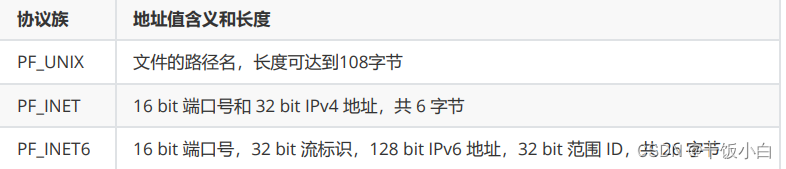

# 这个文件整理一下通信协议和Socket编程：

*参考网址：*[(10条消息) C++项目实战-socket编程_c++ socket_陈达书的博客-CSDN博客](https://blog.csdn.net/weixin_46120107/article/details/126528923)

## socket 套接字概念：

在ECE428的MP0中，我们使用了｜，也就是Linux中的管道符号。使用管道符号可以实现本地进程间通信。而Socket的使用是为了网络进程间的数据传递。

 **所谓套接字Socket，就是对网络中不同主机上的应用进程之间进行双向通信的端点的抽象。**
一个套接字就是网络上进程通信的一端，提供了应用层进程利用网络协议交换数据的机制。从所处的地位来讲，套接字上联应用进程，下联网络协议栈，是应用程序通过网络协议进程通信的接口，是应用程序与网络协议进行交互的接口。
        它是网络环境中进行通信的API,使用中每一个套接字都有一个与之相连进程。通信时其中一个网络应用程序将要传输的一段信息写入他所在的主机socket中，该socket通过与网络接口卡(NIC)相连的传输介质将这段信息送到另一台主机的socket中，使对方能够接收到这段信息。socket是由IP地址和端口结合的，提供应用层进程传送数据包的机制。
      

## 对于Socket中的Port和IP的理解：

MAC地址(物理地址)

**IP地址(逻辑地址)： 在网络中唯一标识一台主机**

**端口号：在一台主机中唯一标识一个进程**

**IP+端口号：在网络环境中唯一标识一个进程**


## 通用socket地址

        socket地址其实是一个结构体，封装端口和IP等信息。后面的socket相关的api中需要使用到这个socket地址。
        之前有说到过，socket套接字上联应用程序，下联协议栈
        对一个一个数据包想要在网络中的两台不同主机间的进程(当然我们这里不包括本地套接字)，只要确认了对方IP(逻辑地址)和端口就可以将数据传送给对方【MAC地址可以根据ARP协议获取到】
socket网络编程接口中表示socket地址是结构体sockaddr,其定义如下：（这个结构体已经不用了！）

```c++
#include <bits/socket.h>
struct sockaddr{                                //已经被废弃掉
        sa_family_t         sa_family;//用于记录地址族类型（对应协议的类型）
        char                sa_data[14];//记录端口号和 IP地址（由于定值14（14个字节（char一个一字节）），只能够存下IPv4的Port和IP信息）
};
typedef unsigned short int sa_family_t;
```

成员：
        sa_family成员是地址族类型(sa_family_t)的变量。地址族类型通常与协议类型对应。常见的协议族和对应的地址族如下所示：


协议族 PF_*和地址族AF_*在头文件bits/socket.h中，二者值相同，可以混合使用。

由于在这个结构体中，sa_data大小固定，只有14个字节。这个数组要存放socket地址值，但是不同协议族具有不用的含义和长度。



**14个字节几乎只能装下 IPv4地址。太捞了！！**

因此，Linux定义了下面这个新的通用的socket地址结构体，这个结构体不仅提供了足够大的空间用于存放地址值，而且是内存对齐的【内存对齐可以加快CPU访问速度，内存对齐问题见我的C语言专栏，有详细介绍】 
这个结构体定义在：/usr/include/linux/in.h


```c++
#include <bits/socket.h>
struct sockaddr_storage
{
sa_family_t sa_family;
unsigned long int __ss_align;//
char __ss_padding[ 128 - sizeof(__ss_align) ];//用于内存对齐
};
typedef unsigned short int sa_family_t;
```

## 专用socket地址

很多网络编程函数诞生早于IPv4协议(用自定义的协议咯，双方共同约定一个规则)，那时候都是使用struck socketaddr结构体，为了向前兼容，现在在socketaddr退化成了 （void *）的作用，传递一个地址给函数，至于这个函数是sockaddr_in还是sockaddr_in6，由地址族确定，然后函数内部再强制类型转化为所需的地址类型。（void指针左值，使用类型强制转化（就像malloc一样。））

**UNIX 本地域协议族使用专用的 socket 地址结构体struct sockaddr_un**

**TCP/IP 协议族有 sockaddr_in 和 sockaddr_in6 两个专用的 socket 地址结构体，它们分别用于 IPv4 和 IPv6：**


所有专用 socket 地址（以及 sockaddr_storage）类型的变量在***\*实际使用时都需要转化为通用 socket 地 址类型 sockaddr\****（强制转化即可），因为**所有 socket 编程接口使用的地址参数类型都是 sockaddr。**

## IP地址转化函数

人们习惯用可读性好的字符串来表示IP地址，比如用点分**十进制字符串**表示IPV4地址，以及用**十六进制字符串**表示IPv6地址，但编程中**我们需要先把他们转化为整数(二进制)方能使用**。而记录日志相反，我们需要**把整数表示的IP地址转化为可读的字符串**。

```c++
//早期：（不推荐使用）
#include <sys/socket.h>
#include <netinet/in.h>
#include <arpa/inet.h>
int inet_aton(const char *cp,struct in_addr *inp);
in_addr_t  inet_addr(const char *cp);
char *inet_ntoa(struct in_addr in);         
//这只能处理IPV4的ip地址，不可重入函数

//现在：
//p:点分十进制的IP字符串
//n:表示network，网络字节序的整数
#include  <arpa/inet.h>
int inet_pton(int af,const char *src,void *dst);//IP_to_Net 将人看的转化为机器看的
/*af:地址族： AF_INET AF_INET6
src:需要转换的点分十进制的IP字符串
dst:转换后的结果保存在这个里面*/
const char *inet_ntop(int af,const void *src,char *dst,socklen_t size);//Net_to_IP 将机器看的转化为人看的
/*af:AF_INET   AF_INE6
src: 要转换的ip的整数的地址
dst: 转换成IP地址字符串保存的地方
size：第三个参数的大小（数组的大小）
返回值：返回转换后的数据的地址（字符串），和 dst 是一样的*/
//点分十进制 --->  网络字节序   inet_pton
//网络字节序 --->  点分十进制   inet_ntop
```

## **socket模型创建流程图和函数解析：**


**Server函数的讲解！！！**

```c++
头文件：#include <arpa/inet.h>
或者：#include <sys/types/h>    #include <sys/socket.h>
int socket(int domain,int type,int protocol);
功能：创建一个套接字
参数：
        domain:协议族
                AF_INET   -->  ipv4
                AF_INET6 -->  ipv6
                AF_UNIX  AF_LOCAL  --> 本地套接字通信(进程间通信)
        type:通信过程中使用的协议协议
                SOCK_STREAM --> 流式协议
                SOCK_DGRAM   --> 报式文件
        protocol:具体的一个协议，一般写 0
                SOCK_STREAM  --> 流式文件默认使用 TCP
                SOCK_DGRAM    --> 报式文件默认使用 UDP
返回值：
        成功：返回文件描述符socketfd，操作的就是内核缓冲区(socket本质上是一个伪文件)
        不同的client连接使用不同socketfd和server进行信息传输。
        失败：-1

int bind(int sockfd,const struct sockaddr *addr,socklen_t addrlen);
功能：绑定，将fd和本地的IP+端口进行绑定
参数：
            sockfd:通过socket函数得到的文件描述符
            addr:需要绑定的socket地址，这个地址封装了ip和端口号的信息
            addrlen:第二个参数结构体占的内存大小
              
int listen(int sockfd,int backlog);
功能：监听这个socket上的连接
参数：
           sockfd:通过socket()函数得到的文件描述符
            backlog:未连接的和、已连接的和的最大值(最多能有几个clients)
              
int accept(int sockfd,struct sockaddr *addr,socklen_t *addrlen);
功能：接收客户端连接，默认是一个阻塞的函数，阻塞等待客户端连接
参数：
           sockfd:用于监听的文件描述符（每个client有不同的socketfd，server recv和write不同client的socketfd传输和获得信息）
           addr:传出参数，记录连接成功后客户端的地址信息(ip、port)
           addrlen:指定第二个参数的对应的内存大小
返回值：
        成功：用于通信的文件描述符
        失败：-1
       
int connect(int sockfd, struct sockaddr *addr, socklen_t *addrlen;
            这个是client的connect函数，socketaddr储存要连接的server的信息。
ssize_t write(int fd, const void *buf, size_t count); // 写数据
ssize_t read(int fd, void *buf, size_t count); // 读数据
```


原文中的程序案例：

```c++
#include <arpa/inet.h>
#include <stdlib.h>
#include <string.h>
#include <unistd.h>
#include <stdio.h>
//定义IP
#define SERVER_IP   "127.0.0.1"
//定义端口
#define SERVER_PORT  8080
 
int main(void)
{
 
    int lfd,cfd;
    char str[INET_ADDRSTRLEN];
    //创建socket套接字
    lfd = socket(AF_INET,SOCK_STREAM,0);  //TCP  ipv4
    //绑定 IP(server) 和 端口号(监听)
    struct sockaddr_in serverAddr;
    memset(&serverAddr,0,sizeof(serverAddr));
    serverAddr.sin_family = AF_INET;
    serverAddr.sin_port = htons(SERVER_PORT);
    serverAddr.sin_addr.s_addr = htonl(INADDR_ANY);  //或者 INADDR_ANY:提供任意一个本地有效IP
    bind(lfd,(struct sockaddr *)&serverAddr,sizeof(serverAddr));
    //监听 设置最大监听数目 128
    listen(lfd,128);
    //等待连接
    struct sockaddr_in clientAddr;
    socklen_t clientAddr_len = sizeof(clientAddr);
    cfd = accept(lfd,(struct sockaddr *)&clientAddr,&clientAddr_len); 
    //数据交换
    int n,i=0;
    char buf[1024] = {0};
    while(1)
    {     
        n = read(cfd,buf,sizeof(buf));
        if(n == 0)  //有客户端断开连接
        {
            printf("有客户端断开连接\n");
        }
        if(n < 0)
        {
            printf("aaaaaaaa\n");
        }
        // inet_ntop(AF_INET,&clientAddr.sin_addr,str,sizeof(str));
        // ntohs(clientAddr.sin_port);
        printf("已收到第%d次数据:%s\n",i++,buf);
        //sleep(2);
        write(cfd,buf,n);
    }   
 
    close(cfd);
    close(lfd);
    return 0;
}
//只能不能实现并发accept一个client之后就会进行read，write工作，server不会再去accept。
```

```c++
#include <arpa/inet.h>
#include <stdlib.h>
#include <string.h>
#include <unistd.h>
#include <stdio.h>
//定义IP
#define SERVER_IP   "127.0.0.1"//client需要知道server的IP，就像学生需要知道教室一样。
// //定义端口
#define SERVER_PORT  8080
 
int main(void)
{
 
    int sockfd;
    //创建套接字  TCP ipv4
    sockfd = socket(AF_INET,SOCK_STREAM,0); 
    //连接
    struct sockaddr_in serverAddr;
    memset(&serverAddr,0,sizeof(serverAddr));
    serverAddr.sin_family = AF_INET;
    serverAddr.sin_port = htons(SERVER_PORT);
    inet_pton(AF_INET,SERVER_IP,&serverAddr.sin_addr);
    connect(sockfd,(struct sockaddr *)&serverAddr,sizeof(serverAddr));
    //数据交换
    char buf[1024] = {0};
    int i=0,n=0;
    while(1)
    {
        //memset(buf,0,sizeof(buf));
        fgets(buf,sizeof(buf),stdin);
        //scanf("%s",buf);
        write(sockfd,buf,sizeof(buf));
        memset(buf,0,sizeof(buf));
        n = read(sockfd,buf,sizeof(buf));
        printf("------a-------\n");
        write(STDOUT_FILENO,buf,n);
    }
 
    close(sockfd);
 
    return 0;
}
```


## 我自己修改的的C++ 多进程的socket：

```c++
/* File Name: server.c */
#include<stdio.h>
#include<stdlib.h>
#include<string.h>
#include<errno.h>
#include<sys/types.h>
#include<sys/socket.h>
#include<netinet/in.h>
#include<unistd.h>
#include<arpa/inet.h>
#include<iostream>
#define DEFAULT_PORT 8000
#define MAXLINE 4096

int main(int argc, char** argv)
{
int    socket_fd, connect_fd;
struct sockaddr_in servaddr;
char    buff[4096];
int     n;
std::string str = "quit\n";
char quit[10];
strcpy(quit,str.c_str());
//初始化Socket
if( (socket_fd = socket(AF_INET, SOCK_STREAM, 0)) == -1 ){
    printf("create socket error: %s(errno: %d)\n",strerror(errno),errno);
    exit(0);
}
//初始化
memset(&servaddr, 0, sizeof(servaddr));
servaddr.sin_family = AF_INET;
servaddr.sin_addr.s_addr = htonl(INADDR_ANY);//IP地址设置成INADDR_ANY,让系统自动获取本机的IP地址。
servaddr.sin_port = htons(DEFAULT_PORT);//设置的端口为DEFAULT_PORT

//将本地地址绑定到所创建的套接字上
if( bind(socket_fd, (struct sockaddr*)&servaddr, sizeof(servaddr)) == -1){
    printf("bind socket error: %s(errno: %d)\n",strerror(errno),errno);
    exit(0);
}
//开始监听是否有客户端连接
if( listen(socket_fd, 10) == -1){
    printf("listen socket error: %s(errno: %d)\n",strerror(errno),errno);
    exit(0);
}
printf("======waiting for client's request======\n");
while(1){
//阻塞直到有客户端连接，不然多浪费CPU资源。
    if((connect_fd = accept(socket_fd, (struct sockaddr*)NULL, NULL)) == -1){
        printf("accept socket error: %s(errno: %d)",strerror(errno),errno);
        continue;
    }
    //父进程到这里已经连接了一个新的client（不然父进程会一直阻塞）（然后下文的fork会为这个client新建一个子进程）
    //接受新连接上的客户端传过来的数据
    //n = recv(connect_fd, buff, MAXLINE, 0);
    //向客户端发送回应数据

    if(!fork()){ //fork=0,如果是子进程，进入
        //对于fork可以再多理解一下。 当fork运行就会出现一个新的自进程。对于原来的父进程fork return子进程的id；对于子进程fork会return0；
        //我倒是可以让所有的自进程进入这里的一个函数进行首发操作
        std::cout<< "Another CLients!" <<std::endl;
        while(true){
            n = recv(connect_fd, buff, MAXLINE, 0);
            /*if(!strcmp(quit,buff)){
                close(connect_fd);
                return 0;
            }*/
            if(n == 0)  //close的时候n==0
            {
                printf("有客户端断开连接\n");
                close(connect_fd);
                return 0;
            }
            //std::cout<< n <<std::endl;
            buff[n] = '\0';
            printf("recv msg from client: %s\n", buff);
        }
        
        //if(send(connect_fd, "Receive Your Love!\n", 26,0) == -1) perror("send error");//给自进程发送系信息
        //close(connect_fd);
        //exit(0);
    }
    //所有的自进程都不会出来，父进程才能到这里。父进程不做信息处理工作，只处理accept连接
}
    close(socket_fd);
}


```

```c++
/* File Name: client.c */
#include<stdio.h>
#include<stdlib.h>
#include<string.h>
#include<errno.h>
#include<sys/types.h>
#include<sys/socket.h>
#include<netinet/in.h>
#include<unistd.h>
#include<arpa/inet.h>
#include<iostream>
#define MAXLINE 4096

int main(int argc, char** argv)
{
int    sockfd, n,rec_len;
char    recvline[4096], sendline[4096];
char    buf[MAXLINE];
struct sockaddr_in servaddr;
std::string str = "quit\n";
char quit[10];
strcpy(quit,str.c_str());
if( argc != 2){
    printf("usage: ./client <ipaddress>\n");
    exit(0);
}

if( (sockfd = socket(AF_INET, SOCK_STREAM, 0)) < 0){
    printf("create socket error: %s(errno: %d)\n", strerror(errno),errno);
    exit(0);
}

memset(&servaddr, 0, sizeof(servaddr));
servaddr.sin_family = AF_INET;
servaddr.sin_port = htons(8000);
if(inet_pton(AF_INET, argv[1], &servaddr.sin_addr) <= 0){
    printf("inet_pton error for %s\n",argv[1]);
    exit(0);
}

if( connect(sockfd, (struct sockaddr*)&servaddr, sizeof(servaddr)) < 0){
    printf("connect error: %s(errno: %d)\n",strerror(errno),errno);
    exit(0);
}

printf("send msg to server: \n");
while(true){
    std::cout<< "send another message" <<std::endl;
    fgets(sendline, 4096, stdin);
    //发送信息
    std::cout<< sendline <<std::endl;
    if(send(sockfd, sendline, strlen(sendline), 0) < 0)
    {
        printf("send msg error: %s(errno: %d)\n", strerror(errno), errno);
        exit(0);
    }
    if(!strcmp(quit,sendline)){
        std::cout<< "End Sending and disconnecting" <<std::endl;
        close(sockfd);
        exit(0);
    }
    //接受信息
    /*
    if((rec_len = recv(sockfd, buf, MAXLINE,0)) == -1){
        perror("recv error");
        exit(1);
    }
    buf[rec_len]  = '\0';
    //std::cout<< sizeof(buf) <<std::endl;
    printf("Received : %s ",buf);*/
}
close(sockfd);
exit(0);
}
```

在ECE428的MP0中用python通过多线程threading实现了多client并发，这里就不放代码了。
